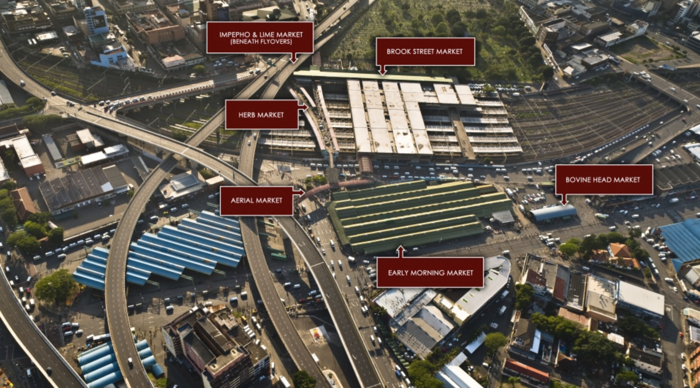

# Week 10! - MIT CREATE UPDATE

### November 9th \(Skype meeting with Kate and Zhenwen\)

After our phase 2 presentation and paper draft, we were able to ask Kate about  more detailed contexts and target audience for this particular data visualization.

Kate's response was to see if we can create data visualizations for both community partners and academia. 

We asked to give little bit more information on the each market location and storage location. It turns out that all markets are all separated.

