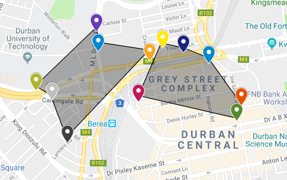
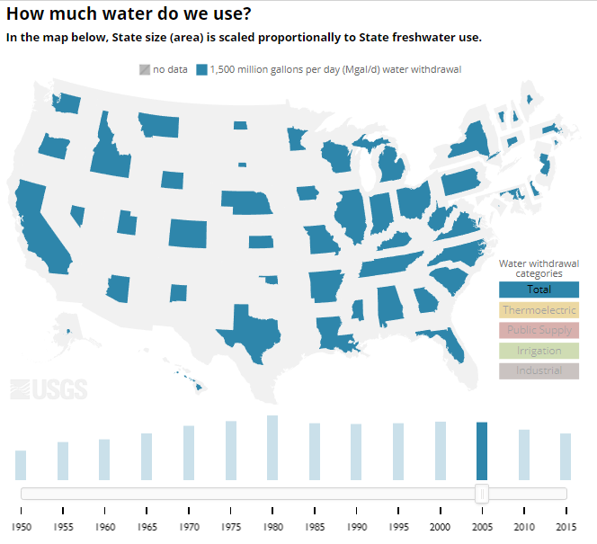

# Week 12! - MIT CREATE Progress and Toolkit Post

* **Progress Post**: Please write a short post on any relevant project updates, including new visualizations, discussions in your group, discussions with your community partner, etc.

* Zhenwen, Kate, and I talked about who is going to see this data visualization? Academia and MIT CREATE's community partners.
* For the next data visualization, here is a rough idea for visualizing basic utilities:

The slider will represent the time frame of each vendors' activity. It would be really great to see geographic and time dependent utilities usage to MIT CREATE and their community partners. 

* **Toolkit Post**: Please write a short post about the potential uses for the following tools, which we may use in the next class:

  * [CARTO: ](http://carto.com/)How is CARTO different from other mapping tools?

* The CARTO system provides a highly accurate geometric rendering of a cardiac chamber with a straightforward geometric display that has the capability to determine the 3-D location and orientation of the ablation catheter accurately.
* CARTO provides the capability to create and tag several potential points of interest during the mapping process \(e.g., double potentials and sites with good pace maps\) and return to them with great precision, which provides significant advantages over conventional techniques.

[**Google Colaboratory:**](https://colab.research.google.com/notebooks/welcome.ipynb) What could Colaboratory be useful for? \(And if you have time, try the [Intro to Panda](https://colab.research.google.com/notebooks/mlcc/intro_to_pandas.ipynb) on the Google Colaboratory welcome site.\)

Google Colaboratory is a free cloud service and now it supports free GPU! and useful for any coding colab with your friends and coworkers.

You can;

improve your Python programming language coding skills. develop deep learning applications using popular libraries such as Keras, TensorFlow, PyTorch, and OpenCV.

