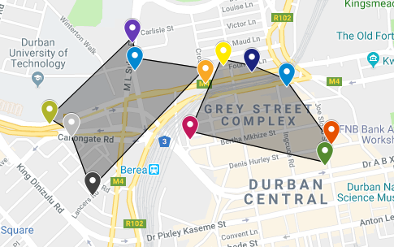
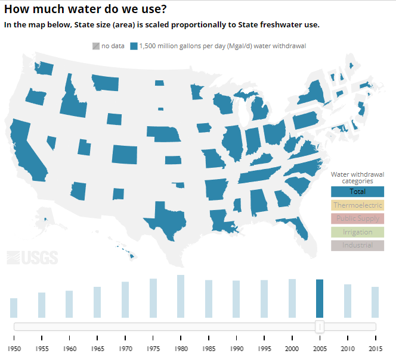

# Week 13! - PROGRESS!

* **Progress Post**: Please write a short post on any relevant project updates, including new visualizations, discussions in your group, discussions with your community partner, etc.

* Zhenwen, Kate, and I talked about who is going to see this data visualization? Academia and MIT CREATE's community partners.
* For the next data visualization, here is a rough idea for visualizing basic utilities:

#### Storage:


Tell story about how much movement there is between vendors and storage sites.


