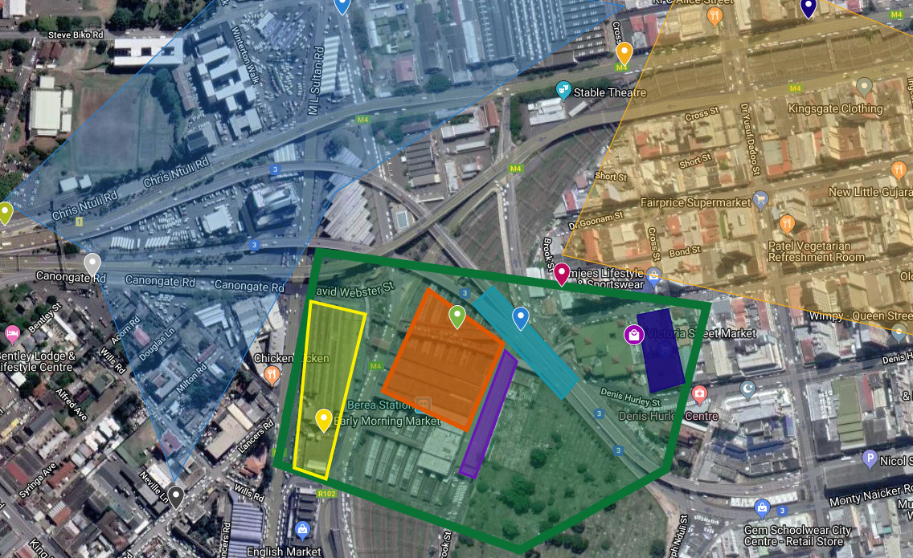

# Week 14! - Final Presentation!

## PHASE 3 PROJECT POST

### Final Visualizations: 

Link: [http://byteyoo.com/DataVis/CREATE/index.html](http://byteyoo.com/DataVis/CREATE/index.html)

### Data Vis Links:

  
Lime & Impepho market

[http://htmlpreview.github.io/?https://github.com/requiemleaf/Data-Visualization/blob/master/MIT%20CTEATE/Lime%20Market\_2.html](http://htmlpreview.github.io/?https://github.com/requiemleaf/Data-Visualization/blob/master/MIT%20CTEATE/Lime%20Market_2.html)

Mealie market

1\)

[https://public.tableau.com/profile/zhenwen.zhang\#!/vizhome/MealieMarket/Sheet1?publish=yes](https://public.tableau.com/profile/zhenwen.zhang#!/vizhome/MealieMarket/Sheet1?publish=yes)

2\)

[http://htmlpreview.github.io/?https://github.com/requiemleaf/Data-Visualization/blob/master/MIT%20CTEATE/Mealie%20Market.html](http://htmlpreview.github.io/?https://github.com/requiemleaf/Data-Visualization/blob/master/MIT%20CTEATE/Mealie%20Market.html)

### Paper

[https://docs.google.com/document/d/1-ImjkxwedmEJWs\_l1Jem4-6ilE2oyJCh6d98AC37mD0/edit?usp=sharing](https://docs.google.com/document/d/1-ImjkxwedmEJWs_l1Jem4-6ilE2oyJCh6d98AC37mD0/edit?usp=sharing)

