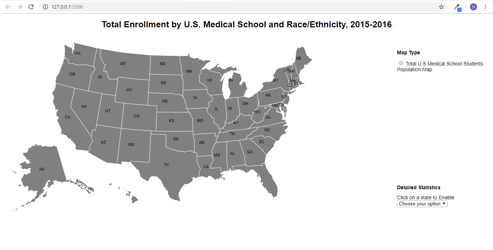
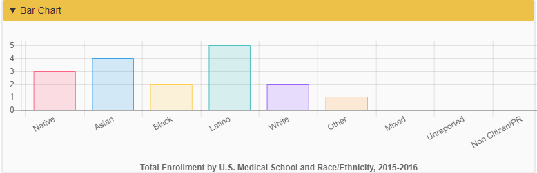
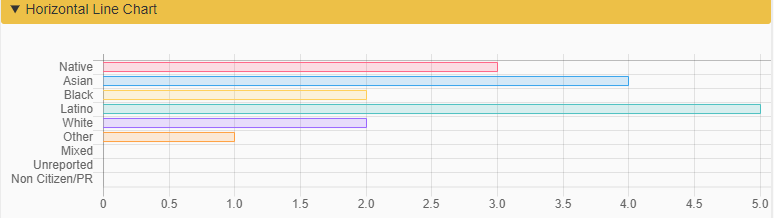
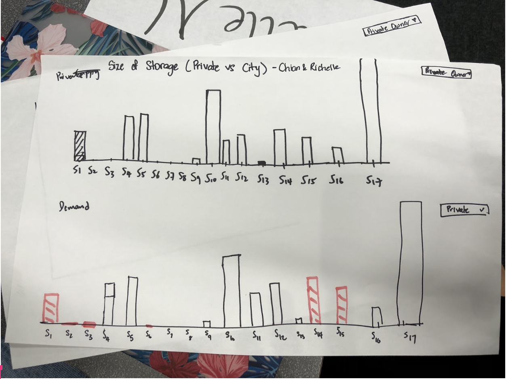

# Week 3! - Phase 1 and The Community Partner

Simple Live Demo Link: [http://www.byteyoo.com/DataVis/](http://www.byteyoo.com/DataVis/)


* **Discuss datasets you’re thinking about.** Write a brief post about some of the datasets you’re considering, either from the “Approved” Datasets, from the community partners, or from your own exploration. What are some of your considerations for choosing your Phase 1 dataset?
* **Discuss your visualization progress.** Please show screenshots and updates on your visualization progress. We will spend some time next week on your work, questions, and progress.


### About my Phase 1 Dataset + Community Partner

From my [**Week 2! - Start Visualizing blog**](https://byteyoo.gitbook.io/byteme/~/edit/drafts/-LNOl9iBvn0njJyMIHIn/data-visualization-fall-2018/week-2)**,** I am going to keep using HTML + CSS + D3,js + Chart.js.

I will be keep using a Total Enrollment by U.S. Medical School and Race/Ethnicity, 2015-2016 dataset as well. I am planning to present this dataset and data visualization for my **Phase 1** presentation.

After my Phase 1, I am going to work with MIT CREATE and use their sample datasets that they provided us last week.

More Community Partner \(MIT CREATE\) content will be updated after my Phase 1 Presentation. Meanwhile, please take your time to check out their research! \(Link below\)

* [MIT CREATE](https://www.create.mit.edu/about-2)

### Visualization Progress

After successfully connecting my CSV file to Web \(Chrome\), I decided to label my U.S map and add few functionality:




My goal is to make a **real-time** data visualization tool using HTML + CSS + D3,js + Chart.js. Possibly adding a python or php script to automate the database transition \(not sure about this approach yet!!\). I believe that **scalable** and **automative** data visualization will make any user's life easier and of course, I will be focusing on visualizing \(front-end\) the data as well. :\)


 I added two features so far \(I will be adding more after later.\)

1. **Map Type**
   1. Total U.S Medical School Students Population \(Total number for each states\)
2. **Detailed Statistics**
   1. Medical Schools \(Per State\)
   2. Ethnicity/Race \(Visual Chart Below\)

#### Visualizing Ethnicity/Race

I am deciding between bar chart or horizontal line chart. I will be using either Chart.js or D3.js. Let me know which chart looks more appealing!





Here is a sample code for bar chart visualization:



```javascript
  // Bar Chart
  var ctx = document.getElementById("barCht");
  var myChart = new Chart(ctx, {
    type: "bar",
    // Data Integration
    data: {
      labels: labl,
      datasets: [
        {
          label: " Volumn:",
          data: datas,
          backgroundColor: bkColors,
          borderColor: bdColors,
          borderWidth: 1
        }
      ]
    },
    options: {
      scales: {
        xAxes: [
          {
            ticks: {
              beginAtZero: true
            }
          }
        ],
        yAxes: [
          {
            ticks: {
              beginAtZero: true
            }
          }
        ]
      },
      responsive: false,
      hover: {
        //global setting
        mode: "single"
      },
      title: {
        display: true,
        text: "Total Enrollment by U.S. Medical School and Race/Ethnicity, 2015-2016",
        position: "bottom"
      },
      legend: false
    }
```



###  For the Week 4! + Random Thoughts 

* I decided not to include longitudes and latitude for each medical schools. Instead, I am going to list them by states.
* I would like to see if I can add each medical school's ranking using this [Medical School Ranking ](https://www.usnews.com/best-graduate-schools/top-medical-schools/research-rankings)dataset.

Cheers!

Steven Yoo

### **Paper-based visualization**



  
**I picked this visualization because 1\) It clearly separates from "Private vs. City" 2\) A single storage variables \(S1 - S17\). I personally like to split data and present its unique solutions. I understand that this is just a prototype, I wish that they have implemented Y-axis \(Size\).** 

 ****


