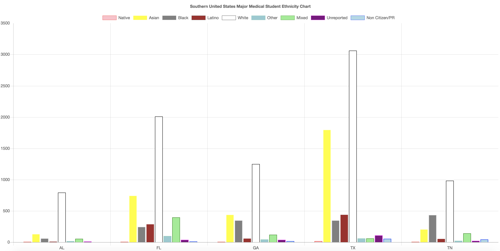
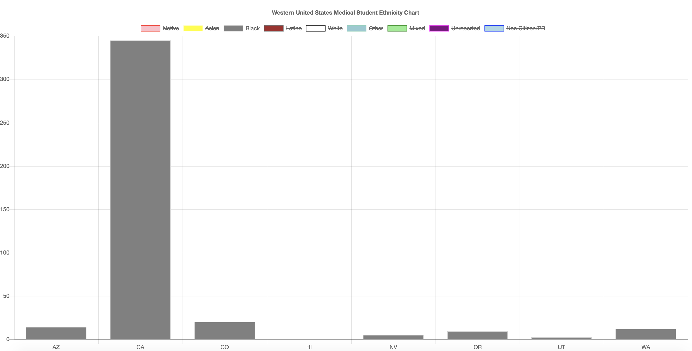
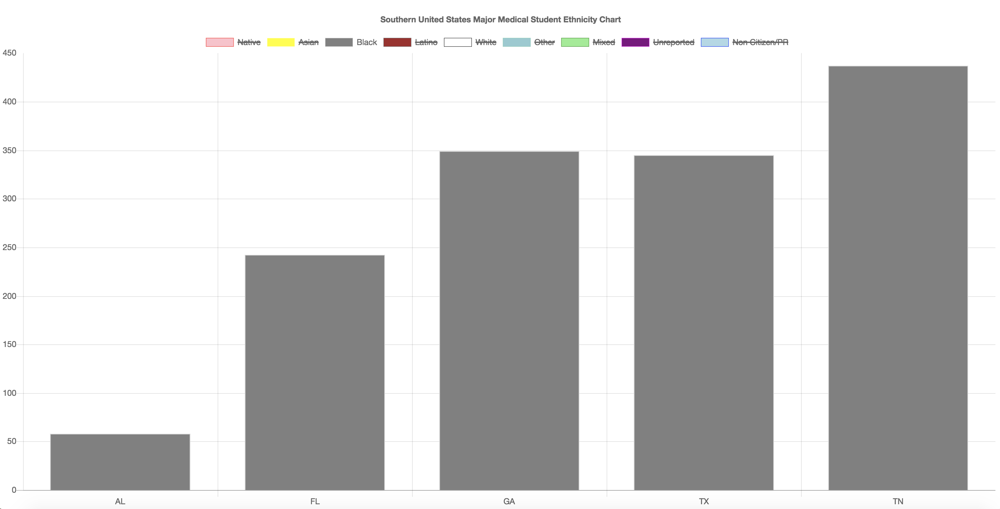

# Week 4! - Medical School and 2016 U.S Election and Population DataVis

### Datasets

I used two set of datasets: US Census Population dataset and Total Enrollment by U.S. Medical School and Race/Ethnicity, 2015-2016 dataset.

#### US Population Map

[http://www.byteyoo.com/DataVis/](http://www.byteyoo.com/DataVis/) - US Population Map  
Dataset \(Census\) [https://www.census.gov/data/datasets/2017/demo/popest/state-total.html](https://www.census.gov/data/datasets/2017/demo/popest/state-total.html).

AND

#### Western US and Southern US

[http://byteyoo.com/DataVis/Medical/](http://byteyoo.com/DataVis/Medical/) - Total Enrollment by U.S. Medical School and Race/Ethnicity, 2015-2016 \(Western US\)

[http://byteyoo.com/DataVis/Medical/southern.html](http://byteyoo.com/DataVis/Medical/southern.html) \(Southern Major Cities\)

### U.S. 2010 Census Population dataset + Total Students in U.S. Medical School

I used 2010 Census population dataset to see if each states have similar patterns. Both these two maps have shockingly similar ratio. I believe that the more populated states receive more government/federal aids to conduct research and expand their programs even further.

### Western United States Medical Student Ethnicity Chart

#### These bar graphs represent Western US and Southern US Medical Student Ethnicity.  

#### If we filter this data more...

#### Black Medical Students Western US vs Southern US

  
In general, there are more Southern US Medical Students then Western US Medical Students. There are many factors: 1\) African-American/Black Friendly Schools, 2\) Well Established African-American/Black Society and Cultures.   
  
Related Articles

[https://www.usnews.com/education/best-graduate-schools/top-medical-schools/slideshows/10-medical-schools-with-the-most-african-american-students](https://www.usnews.com/education/best-graduate-schools/top-medical-schools/slideshows/10-medical-schools-with-the-most-african-american-students)

[https://www.census.gov/newsroom/releases/archives/2010\_census/cb11-cn185.html](https://www.census.gov/newsroom/releases/archives/2010_census/cb11-cn185.html)

#### Conclusion:

There are many ways to visualize the data. Data Visualization help people understand the significance of data by placing it in a visual context. It allowed me to think critically how am I going to convey the users with easy understand of this data. I would like to try different tools such as Tableau and Unity 3D for my next Data Visualization project.

Cheers,

Steven Yoo

  

### 

