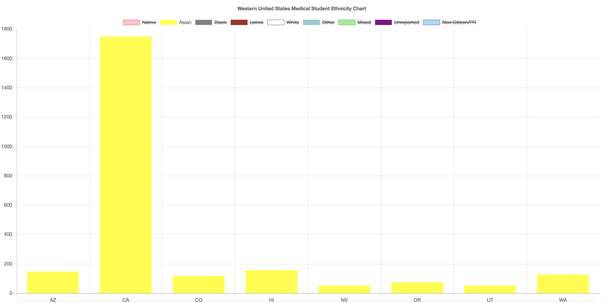

# Week 4! - Medical School and 2016 U.S Election and Population DataVis

### Datasets

I used two set of datasets: US Census Population dataset and Total Enrollment by U.S. Medical School and Race/Ethnicity, 2015-2016 dataset.

[http://www.byteyoo.com/DataVis/](http://www.byteyoo.com/DataVis/) - US Population Map 2016  
Dataset \(Census\) [https://www.census.gov/data/datasets/2017/demo/popest/state-total.html](https://www.census.gov/data/datasets/2017/demo/popest/state-total.html).

AND

[http://byteyoo.com/DataVis/Medical/](http://byteyoo.com/DataVis/Medical/) - Total Enrollment by U.S. Medical School and Race/Ethnicity, 2015-2016 \(Western US\)

[http://byteyoo.com/DataVis/Medical/southern.html](http://byteyoo.com/DataVis/Medical/southern.html) \(Southern Major Cities\)

### U.S. 2010 Census Population dataset + Total Students in U.S. Medical School

I used 2010 Census population dataset to see if each states have similar patterns. Both these two maps have shockingly similar ratio. I believe that the more populated states receive more government/federal aids to conduct research and expand their programs even further.

### Western United States Medical Student Ethnicity Chart

#### If we filter this data more...

#### Black Medical Students Western US vs Southern US

####  

This bar graph represents Western US States Medical Student Ethnicity.  

  

### 

