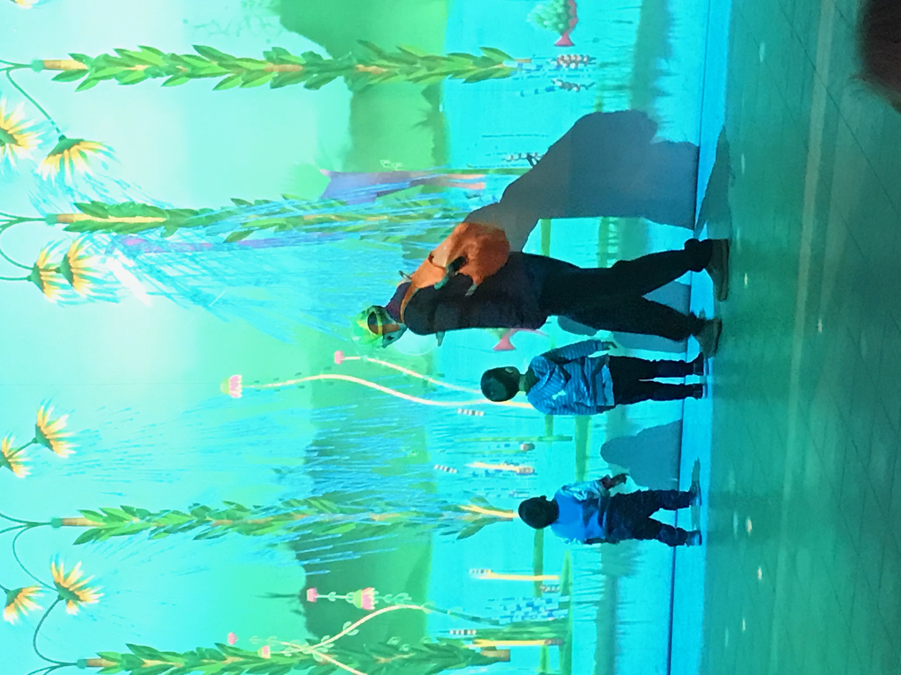
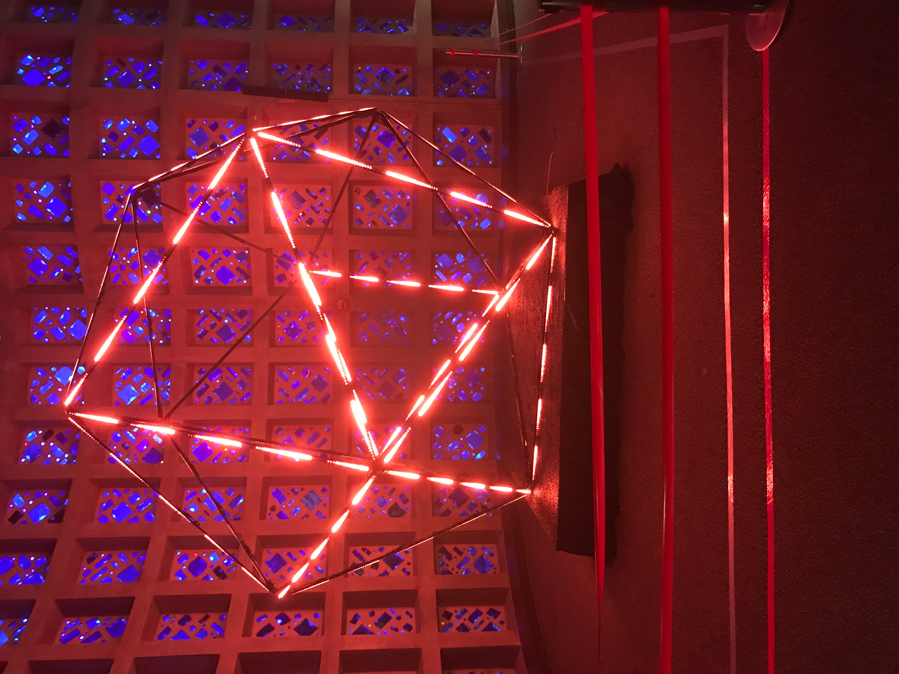
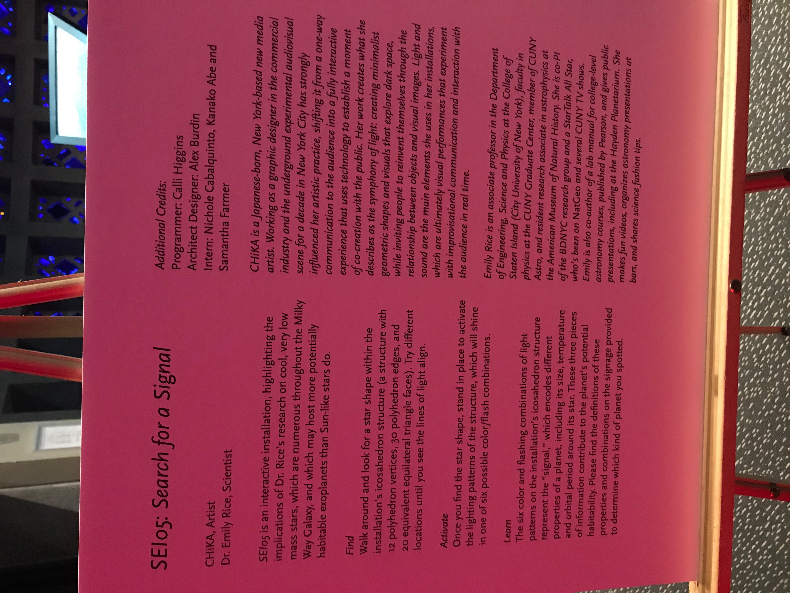
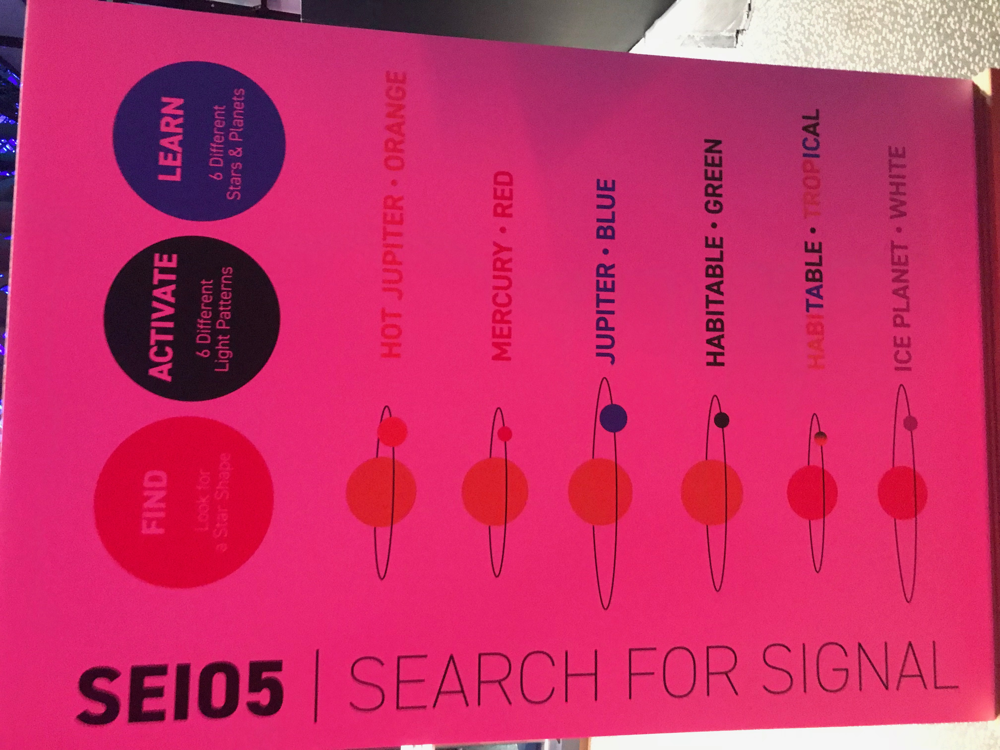
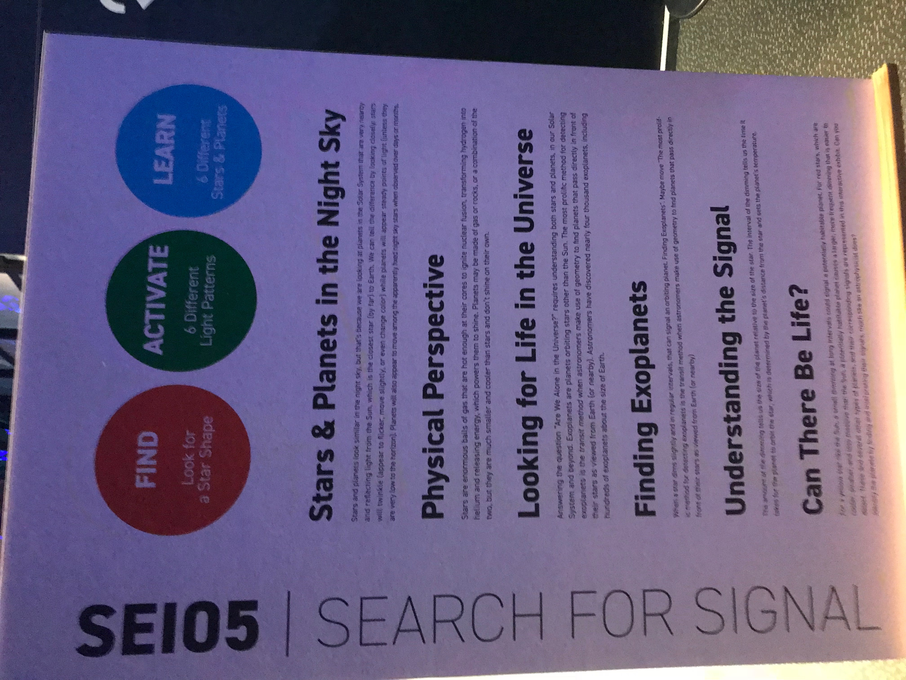
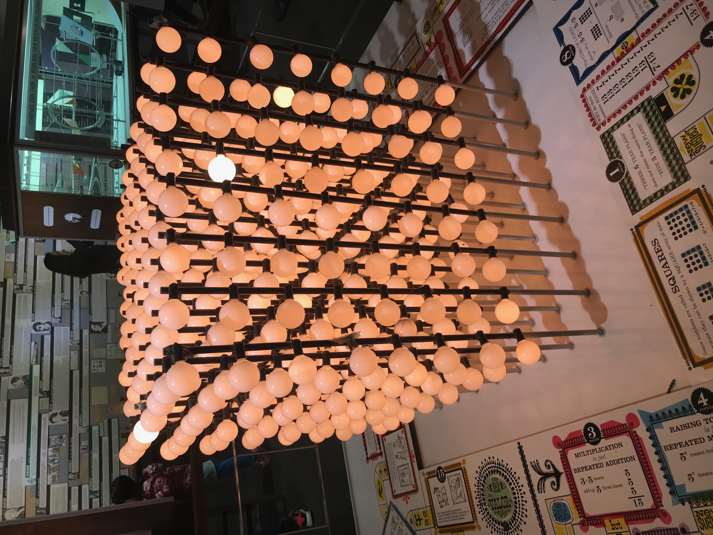

# Week 5! - Self-guided tour of NYSCI and Book Thoughts

###  Self-Guided Tour of NYSCI


 [New York Hall of Science](http://nysci.org/location/) \(NYSCI\) and take your own self-guided tour of NYSCI’s exhibits, “[Connected Worlds](http://nysci.org/connected-worlds/)” and “[Mathematica](http://nysci.org/mathematica/).” Please take notes on BOTH exhibits.


I really enjoyed the NYSCI Self-Guided tour! The last time I came here was around 2008! \(So about 10 years or so\). It was really awesome to see how new technologies has changed the NYSCI programs.

Here is my video for my trip! Enjoy :\)



**Connected Worlds**

Connected Worlds is an interactive ecosystem developed for the New York Hall of Science. The installation is composed of six interactive ecosystems spread out across the walls of the Great Hall, connected together by a 3000 sqft interactive floor and a 45ft high waterfall.

Children play around with a virtual-reality water in the system and have to work together to control and deliver the water across the different environment settings. Virtual clouds return water from the environment settings to the waterfall which releases water to the floor when it rains.

**Mathematica**

Mathematica displays the range of mathematics and uses a time-tested collection of exhibits to share the excitement that mathematicians find in pursuing their science. Through a combination of hands-on activities and dynamic models, visitors are invited to explore how math has impacted so many facets of our contemporary world, from the devices we carry in our hands to the changes in social sciences, art, music, and architecture.  

### Blog Post: Book Thoughts:


Start browsing the recommended books listed in the syllabus for this class. Write a short post about 2-3 books that interest you, and explain why.


#### 1. The Data Revolution: Big Data, Open Data, Data Infrastructures and Their Consequences

by Rob Kitchin  SAGE Publications: 2014.



I believe that this book will allow any users to learn more about the Data, whether it's conceptualizing a simple data or building any shape of data as well. Big data analytics helps organizations harness their data and use it to identify new opportunities and focuses on finding hidden threads, trends, or patterns from heaps of company data. It represents significant information which can open new avenues of opportunities and the way this information is analyzed to help tap on those underlying opportunities. 

**2. Graphesis: Visual Forms of Knowledge Production \(metaLABprojects\)** 

by Johanna Drucker  Cambridge: Harvard University Press, 2014 



Graphesis provides a graphical knowledge. I believe that it is good to study media and graphic design history, This book outlines the principles by which visual formats organize important content.  

