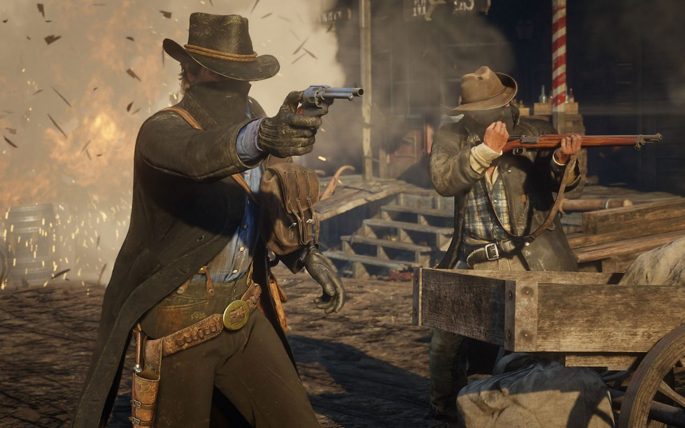

# Week 10!

### Timeline \(Infographic\)



**PDF Version Link:** [**https://www.dropbox.com/s/gnm8abbgwaq0tnr/NarrativeTimeline.pdf?dl=0**](https://www.dropbox.com/s/gnm8abbgwaq0tnr/NarrativeTimeline.pdf?dl=0)\*\*\*\*

### \(The Matrix\) Movie Response:


Choose a film from the list to watch and write a 200 word response. Are they Utopian or Dystopian? Was there a single technology or event that made it that way. Could that technology or another equal event change it from Utopian to Dystopian, or Dystopian to Utopian? Are there any story elements or themes that you can borrow from for your own final project?


I watched The Matrix. I think the Matrix is a great example of a dystopia because of many characteristics that it displays. This world inside the computer fabricates what you hear, smell, see, taste and even touch. The computers feel that by controlling every minute detail of what humans are allowed to experience they are bettering the human’s lives while also preserving their own. This is a great example of technological control. These advanced machines have progressed so far as to oppress the very beings that created them. Because they have isolated and incapacitated each human, they completely control all sources of information, independent thought, freedom, or true individuality, all characteristics of a dystopian society and would like to borrow from that theme to my own final project. Also, the natural world, the world taken over by machines where each human’s body actually resides, has been completely banned from The Matrix, so much so that only a tiny fraction of the population even have knowledge of it.These technologies can change it from Dystopian to Utopian. 

### Discovery Log Week 10! - Red Dead Redemption 2 \(PS4\)

  
After going to the several conferences. I wanted to take a break from academia and have some rest for this week. It feels weird to talk about gaming \(because, most of my discovery log is consist of conferences and technology blog\) but, I am an avid gamer. I've been playing since NES \(Nintendo Entertainment System\). My favorite NES games are Super Mario Bros. and Excitebike. When I heard about the Red Dead Redemption 2's enhanced graphic on PS4 platform. I had this game right away and didn't disappoint me at all. 

**What have I discovered this week?**  
It's been eight years since Rockstar released Red Dead Redemption, an open-world, story-based action-adventure game set in the Wild West for the PlayStation 3 and Xbox 360. Most gamers consider it to be a modern masterpiece, and some \(myself included\) even herald it as one of the best games ever made.

Developed by Rockstar Games -- the studio behind marquee franchises such as Grand Theft Auto and Max Payne -- the original Red Dead Redemption was an open-world Wild West epic set in 1911. Consisting primarily of a single-player, action-adventure campaign, the game cast you as John Marston, a complex and conflicted former outlaw forced to hunt down his old crew after the government takes his wife and son hostage. ****As video games go, Red Dead Redemption was notable for the vast landscapes and breathtaking vistas of its map, which takes you through a surprisingly diverse mix of Western-influenced settings -- everything from dusty ghost towns and Mexican mesas to serene prairies and snowy mountain trails populated with lumbering grizzlies. So I really appreciated their detailed work and effort to create this masterpiece. 

Cheers,

Steven Yoo

