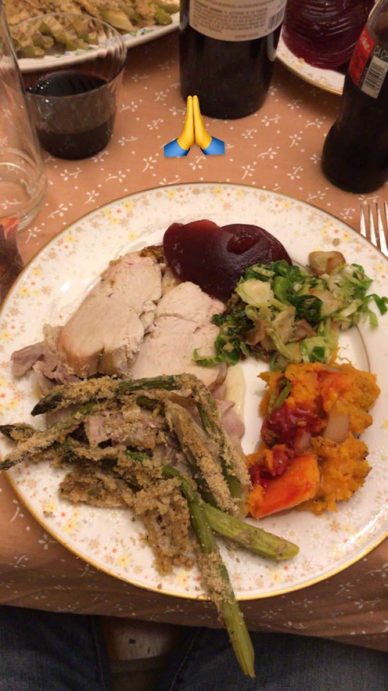

# Week 11!

### Discovery Log Week 11: First American Traditional Thanksgiving with my friend and his family.

Weirdly enough. During my first years as a college student. Thanksgiving was the holiday I’d almost always forget. It was several days off after a long week of papers, deadlines, and exams, yes, but I rarely thought about the traditional turkey feast. I have been living in America for about 11 years now and never been to traditional Turkey, NFL, family gathering type of Thanksgiving. So soon enough I was introduced to it all: cranberry sauce, sparkling apple cider, stuffing.

I discovered that Native Americans invented popcorn. They put ears of corn in the fire and caught the hot kernels as they popped out. Thanks to my friend's mom, a retired primary school teacher taught me about the culture and history of Thanksgiving.

  
Thank you my friend David and his family for an awesome Thanksgiving experience!

Cheers,

Steven Yoo

  

  

