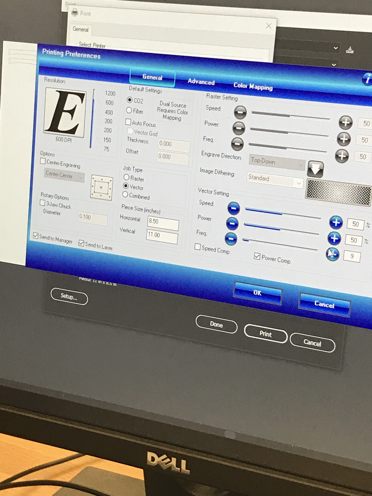

# Week 12!

### Discovery Log Week 12: NYU Makerspace and Laser Cutter

For my Ideation and Prototyping class, my partner \(Ozema\) and I were deciding to see if we want to use laser cutting machine or 3D printer to create our product.

We decided to use laser cutter because it is a lot faster to make multiple prototypes and involves less risk for any failure prints. There is a lot of adjustment and constant surveillance throughout the 3D printing process. 

**What did I discovered?:** I discovered that NYU Tandon Makerspace provides a cutting edge workspace lab created to foster collaborative design projects and gives even greater opportunities for students and faculty to engage in innovative and entrepreneurial activities. I really liked the idea of collaboration and using Ozie's skillset and my strength to create something creative and innovative to our Ideation and Prototyping project. I am excited to see what we can create and present at the showcase.

Cheers,

Steven Yoo

### The Sunless Age: Future Dystopia Project 

#### Blindness Prevention Sunglasses: BPGs

Materials:

1. Sunglasses Frame
   * Wood: Low-Quality Version
   * Acrylic: High-Quality Version
2. Sunglasses Lenses: Acrylic​
3. Hinges
   * Wood
   * Screws
4. Paint: Low-Quality Version
5. LED light strip\(s\)
6. Lilypad Battery Holder
   * Watch Batteries​
7. Wires
8. Soldering/Gluing Tools

Glasses Measurements

* Frames: 6 inches by 4.45 inches
* Arms: 5.7 inches by 1.32 inches
* Hinges: 1.5 inches

​

Social Inequality \(Rich vs. Poor\):

The BPGs with LEDs on the exterior frame are the low-quality version because the light doesn’t directly hit the wearer’s pupils via the lenses like with the higher quality version. At a whopping $10,000 per pair, only the rich can afford the higher quality BPGs, and as a result poor people have worse eyesight than the rich \(Low quality BPGs cost $1000 per pair\).

* Will include price plaque in front of each type of BPG for final showcase

​

Inspiration for BPG Design:

[https://grapee.jp/en/104093](https://grapee.jp/en/104093)

* High-quality sunglasses that the rich can afford​

​[https://www.youtube.com/watch?v=m0EwDsWivV4](https://www.youtube.com/watch?v=m0EwDsWivV4)

* Low-quality sunglasses that the poor can afford

​

​Video Message From the Future:

Anti-war message warning humans of the dark future to come

* Explanation of the sunless age
* Description of glasses and their use \(how/why these have become essential to having a decent quality of life\)
* Social commentary?
* Found footage, home video feel
  * Fisheye lens?
  * Recorded on iPhone?
  * Grainy
  * Interruptions

​  

