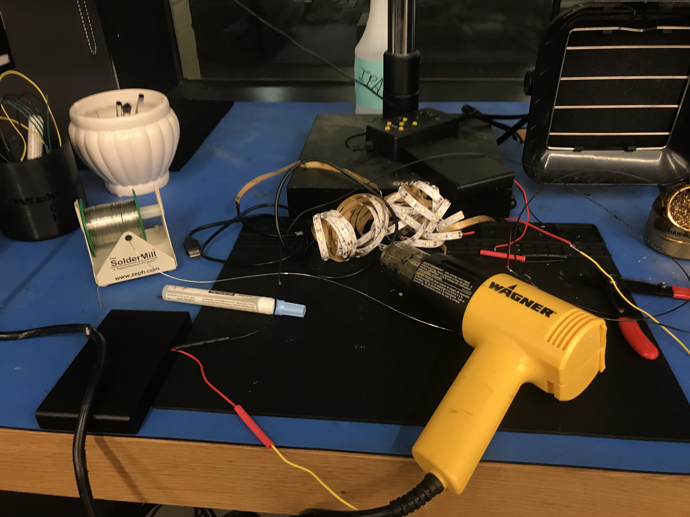

# Week 13!

### Discovery Log Week 13: FINAL PROJECT I&P

Ozie and I are still making a prototype for our Ideation and Prototyping class. Blindness Prevention Sunglasses: BPGs. After the sun burns out as a result of nuclear war, scientists develop a new type of sunglasses that mimic sunlight. These glasses must be worn for 8 hours per day in order to prevent blindness.

We had our LED products shipped from Amazon. However, our shipment was delayed for 5 whole days :\(. Meanwhile, we tried to use other scrap electronics from the MakerSpace or my house to make this BPG product work, but eventually failed.

We are going to keep working on our final project and hopefully we will be able to finish it by next class session. 

Cheer,

P.S. My server was down for whole week!! Sorry for your inconvenience.  

Steven Yoo

