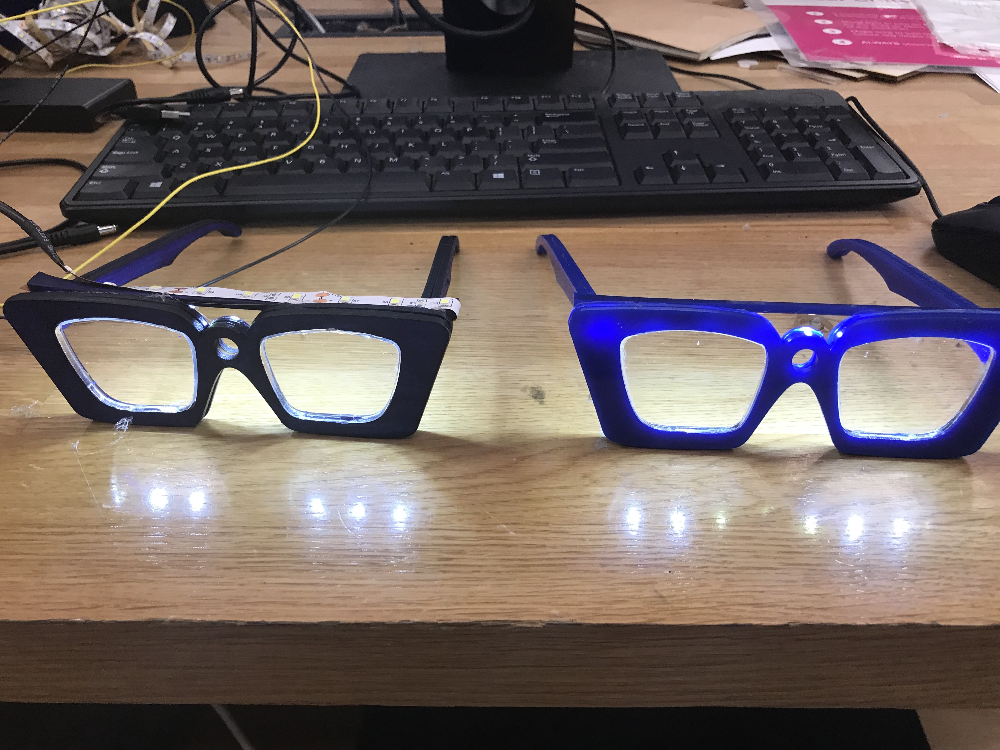

# Week 14!

### Discovery Log Week 14: FINAL PROJECT I&P \(FINISHED!\) 

We spent our Friday and Monday to complete this Prototyping product. After fighting with Amazon, We finally got our glasses lit up and able to finalize our products. 

As you can see from the picture, Wooden Glasses are poorly designed and made from less sturdy materials. On the other hands, a blue acrylic glasses are brighter and made from sturdier materials. We were able to solve our power supply problem by using 12V battery back and running them portably.

We are currently working on our short commercial video for our showcase. Thank you for following up my weekly discovery log and I've learned a lot and met some great people along the way. I can't wait for my next semester.

To be continue.

Cheer,

Steven Yoo

