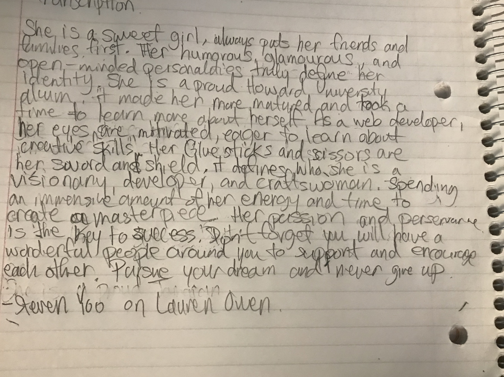
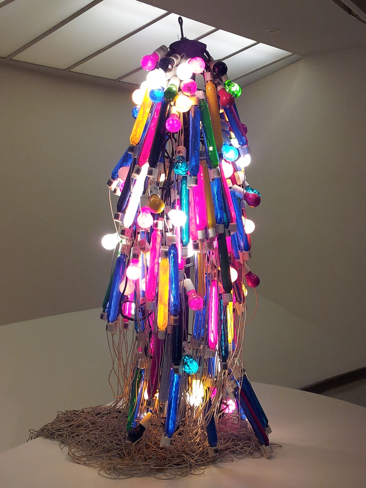
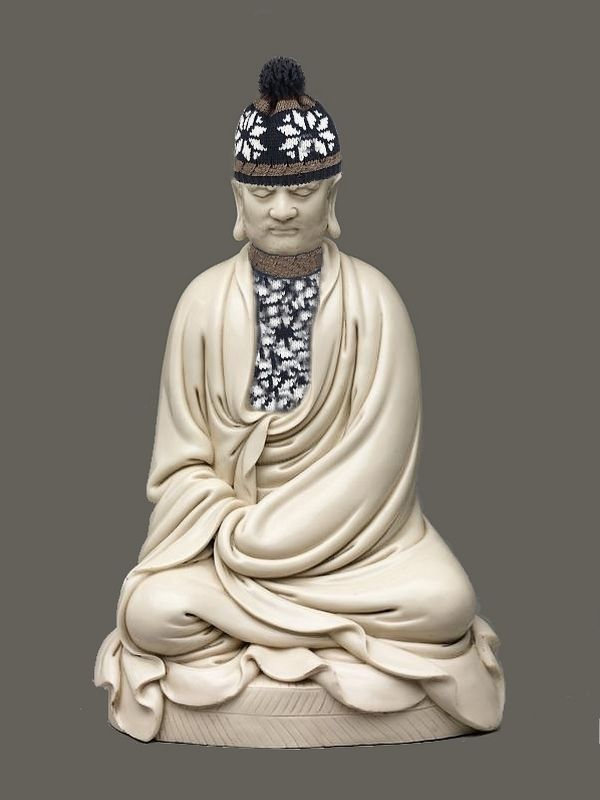
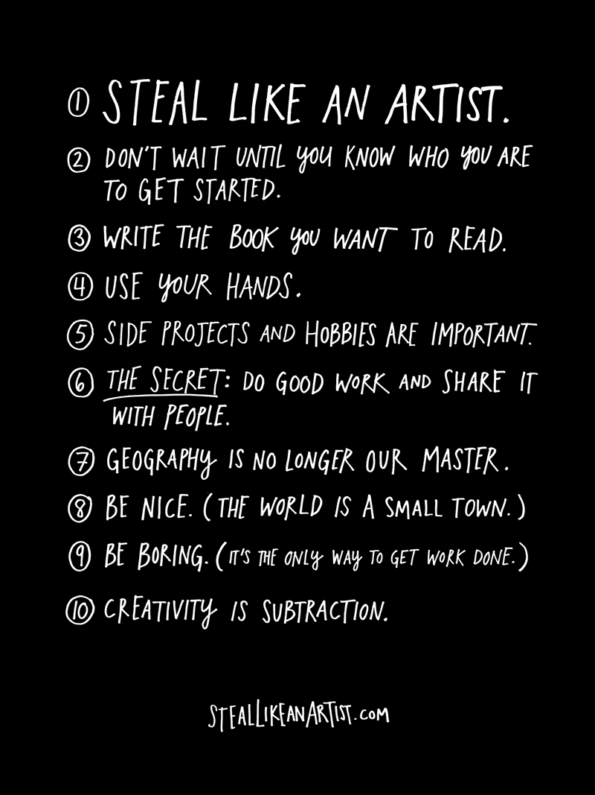
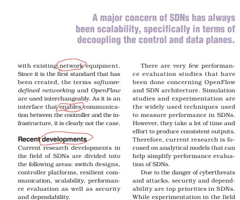
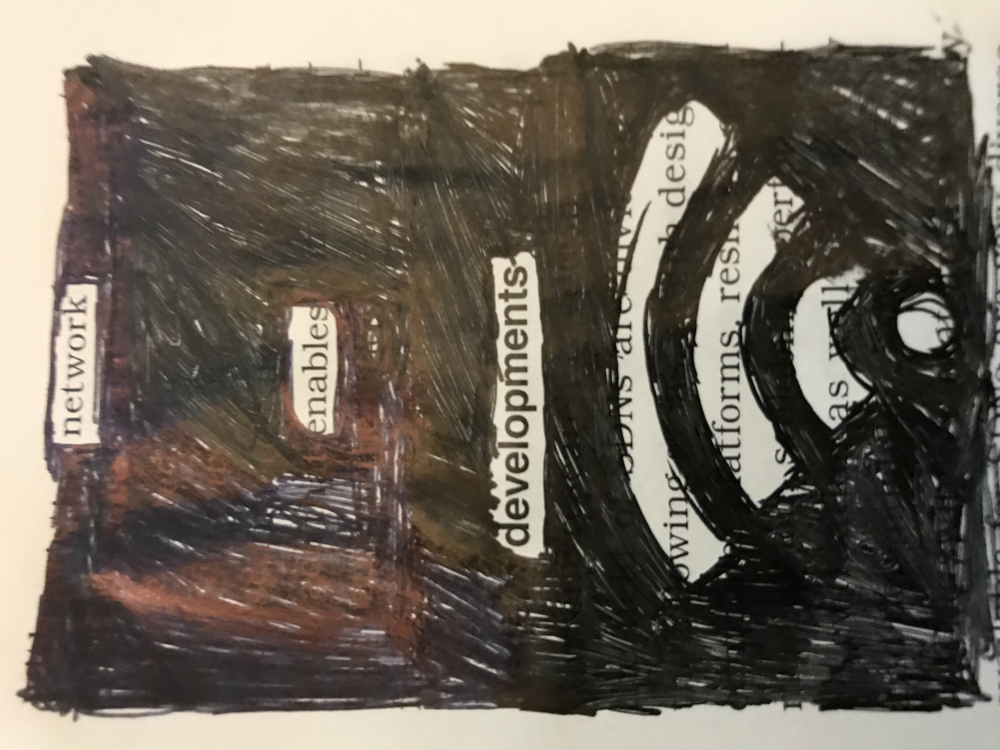
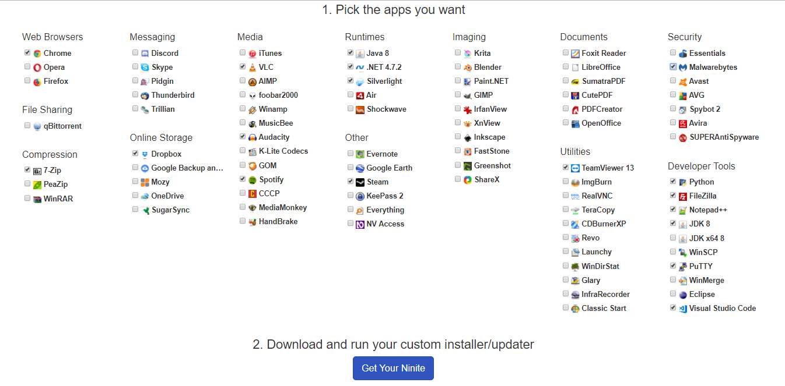

# Week 2!

### **Freewriting Assignment**


Post your Freewriting Assignment to your blog. What is your favorite phrase that you came up with?


> **Transcription**
>
> "She is a sweet girl, always puts her friends and families first. Her humorous, glamorous, and open-minded personalities truly define her identity. She is a proud Howard University alum, it made her more matured and took a time to learn more about herself. As a web developer, her eyes are motivated, eager to learn about creative skills. Her glue sticks and scissors are her sword and shield. It defines who she is as a visionary developer and craftswoman. Spending a vast amount of her energy and time to create a masterpiece. Her passion and perseverance is the key to success. Don't forget you will have a wonderful people around you to support and encourage each other. Pursue your dream and never give up."
>
> Steven Yoo

#### What is your favorite phrase that you came up with?

My favorite phrase would be "Her glue sticks and scissors are her sword and shield". It is implying that her craft tools are her ultimate weapons. :\)

### Everything Is a Remix Response


Discuss any epiphanies or insights that occurred while watching, how it reflects your own process \(or does not and why\) or how it will inform or change your own process \(or will not and why\).






I want to first point out that... I was amazed by high quality work of Kirby Ferguson's "Everything Is a Remix" series. Kirby focuses the basic elements of creativity: copy, transform and combine. My Media Law class is currently learning about copyright along with various criteria for what makes something illegal. It is very cool to see my Integrated Digital Media \(IDM\) curriculum is somehow relate to each other. The documentary educates the viewers from a historical and social aspect. Each videos shows how creative and transformation of previous pieces have been the foundations of media industries.

#### How it reflects your own process  or how it will inform or change your own process.

My process website is focuses on discovering something new. Kirby's "Everything Is a Remix" videos brought some interesting points. I think his points will encourage and further pursue to use my creativity on my processing website. Kirby mentions that "everything we make is a remix of existing creations." and "Creation requires influence". As a creator, everyone should be aware of what does being original mean. Does that originality concept still viable? It is difficult to say. Maybe we are only limited to produce new ideas copy, transforming and combining as what Kirby states in his video. It is our \(creators\) job to accept it and respect our view of concepts as creativity, copying artworks.

### Bonus

**Find an example of a piece of art you like and follow it back at least 2 generations of influence.**

  

### Steal Like An Artist Response


**Write a response, and post to your process website. Or just watch the** [**TedXTalk**](https://www.youtube.com/watch?v=oww7oB9rjgw) **and use the book as reference.**


I really enjoyed reading this book! I noticed that our world is widely connected then any other generations \(Thanks to the internet\). So there have been nearly infinite arts that already have produced. On the other hand, we have people in the internet that discourages an artist's work. Nothing is original, but that’s not a bad thing. I believe there is still a lot of great art to learn from. The best kinds of art and artists thrive on many different influences. Now, it doesn't mean that try to be an exact image of an artist you like but instead, see through their eyes. Be creative and imitate your favorite artists. This is also known as "transformative" artwork. I personally learn a lot from this book. Thomas Edison didn't invent the lightbulb in the first place. He successfully commercialize the product by trying different filament types. There is a quote in this book that resonated me. 

> _What a good artist understands is that nothing comes from nowhere. All creative work builds on what came before. Nothing is completely original. - Austin Kleon_

  
In conclusion, whether you are an artist, software programmer, chef and so on and so forth. I think it is critically to keep move forward and do not let you limit yourself in one place. It is important to create your own world and find communities that you can grow.

### **Newspaper Blackout Poem**

#### Software-Defined Networks Article

"A software-defined network \(SDN\) is an emerging network architecture that allows a centralized software program to control the behavior of an entire network."

This article is from IEEE Potential magazine. [https://ieeexplore.ieee.org/document/8457431/](https://ieeexplore.ieee.org/document/8457431/). When I saw these words of network, enables and developments. I think this simple phrase/poem is powerful enough to have different meanings for each people. For example, "social" network enables developments and "physical wifi" network enables "deeper" developments. I want my audience to use their imagination!

### Discovery Log Week 2: Setting Up Essential Software and Conference Update

Like I have mentioned last week. I am going to explore and discover some great applications or software that I found this past week. :\)

My friend introduced me this awesome tool called **Ninite!**

  
This guide is recommended for Windows 10 users \(mostly\).  
  
**Recommendation: Ninite**



Ninite is a software package management that lets users seamlessly install application for the Windows OS.

**Here are my recommendation applications:**

**Web Browser: Google Chrome,** has a simple design that makes it easy to handle the web. Google Chrome is one of the best internet browsers because it is easy to use and secure.

**Compression:** **7-Zip**, 7-Zip has been around for a while and they have ranked at the top for best compression utility.

**Online** **Storage**: **Google Backup or Dropbox,** If you are NYU student, Google Drive will be a better option. You will get a free 1TB online storage. Otherwise, Dropbox will give you 2GB of free online storage and easy to use.

**Media: VLC, Audacity and Spotify**, VLC and Audacity is a free and open-source video and audio media players. Spotify is a music streaming service :\).

**Runtimes:** I would usually get all of them. You never know when you are going to use them in the future.

**Developer Tools:** Python, Filezilla, Notepad ++, JDK 8, Putty, and Visual Studio Code

**Integrated Development Environment \(IDE\):** Visual Studio Code is an editor that edit-build-debug with ease. With support for hundreds of programming languages, VS Code assists the users with syntax highlighting.

I have used other editors like: Sublime and Atom. But I find both editors to be very complicated.

Sublime has a $70 license fee with free trial \(whack!\)

Atom feels slow. Sometimes, opening a file or switching tabs has noticeable lag. \(Ugh!\)

I will be attending NYC Media Lab Summit 2018! September 20th to 21st. I am really excited meet and see amazing projects and people from across the NYC's industry. I will be writing about my thoughts about each workshops and innovative demos. 

Stay tuned for next week's discovery log!

Steven Yoo

