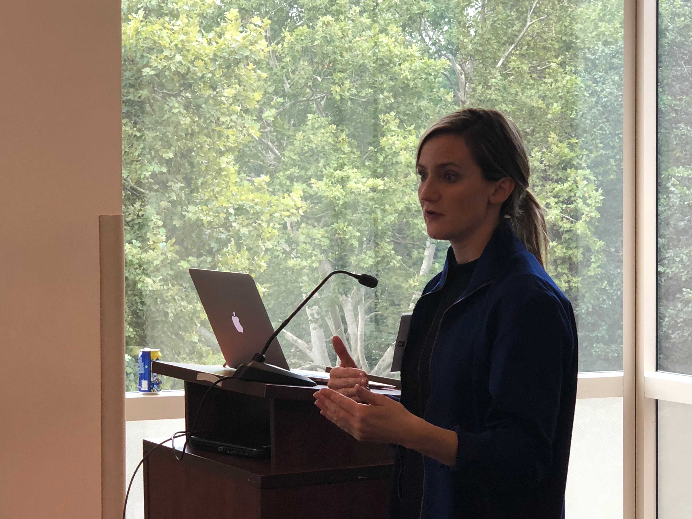
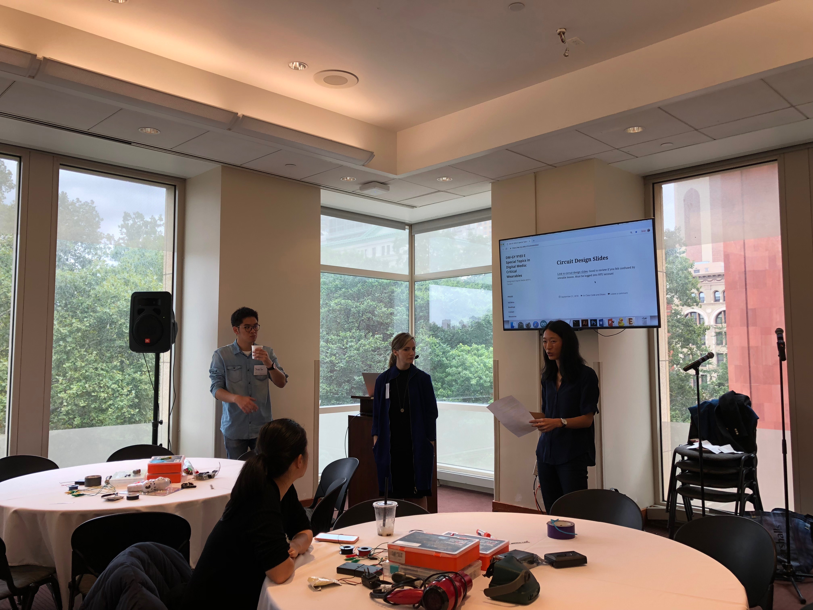
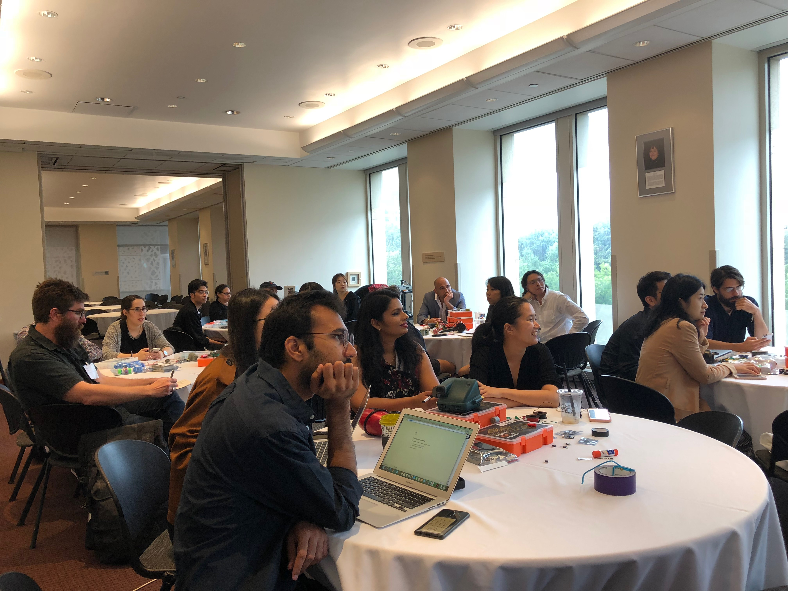
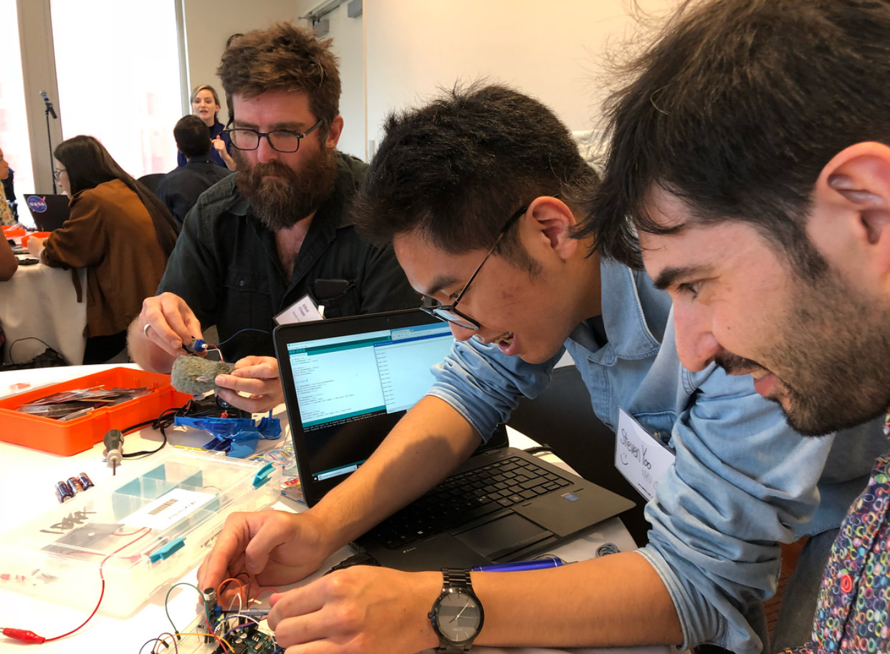
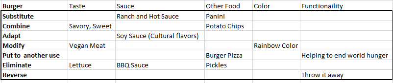
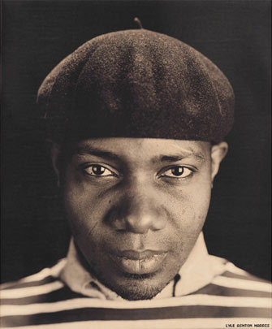

# Week 3!

### Metal Gear Solid 2 vs. 4 Response


**Discuss any epiphanies or insights that occurred while watching, compare and contrast the process of 2 versus 4, how it reflects your own process \(or does not and why\) or how it will inform or change your own process \(or will not and why\).**


Growing up with the PlayStation 2, one of my favorite game is Metal Gear Solid 2 \(MGS2\). I would spent countless hours on finishing up the storyline. Hideo Kojima, Japanese game designer really took his time to make MGS2 from its predecessor \(MGS1\). The PlayStation 2 was one of the most revolutionary gaming consoles ever made, and it also produced some of the best graphic \(from that era, of course\) and games ever. Metal Gear Solid 2 was no exception. From this documentary, Kojima mentions that MGS1 makes a reference to 2001: A Space Odyssey movie character and MGS2 introduction scene was influence to  movie Titanic \(sinking scene\). Kojima and his team uses Lego pieces, physical experiences \(visiting NYC and simulating the action scene\) and physical drawing \(notebook\) to enhance the game's overall visualization and storyline. I've learned that I should utilize more visualization aspect of my process and discovering what were my influences.

I thought it was very interesting when Shikawa, Kojima's close friend and video designer mentions about PS2 to PS3 graphic enhancement. It may take 10 times to develop an ideal background lightning. Sasaki also mentions that it takes a lot of time to create various effects. This added work brought about significant delays in the Metal Gear Solid 4. Despite of that huge amount of stress, the team still manage to create a masterpiece of its own! My point is that I should try my best and produce a high quality process content.

**Random Thought:** I thought Metal Gear Solid 2 vs 4 \(Snake\) reminded me X-Men Logan and Old man Logan. 

:\)

Steven Yoo

### Discovery Log Week 3: New York City Media Lab \(NYCML' 18\)

I had a chance to participate this year's NYCML'18  at the NYU Kimmel Center! Essentially, NYCML is a summit/conference that brings best thinking, projects, and talent from across the city's industry and university. They provide a lot of cool discussions, hands-on workshops, and more than 100 demos about the digital media innovation.

I was helping out Professor Kathleen McDermott's " **Speculative Wearable Tech + Recycled Electronics".** In this workshop, we discussed the future of wearable in relations to sustainability. We then created extreme, imaginative, and speculative designs for wearables that cannibalize electronic junk from the past 30 years. 

#### Here are some pictures taken from NYCML 18:

####  Remote Controlled Motor :\), It was their first time doing hardware and software! \(Explain their Process\)

{% embed data="{\"url\":\"https://youtu.be/HWQxpLw1\_8U\",\"type\":\"video\",\"title\":\"NYCML 18\'\",\"icon\":{\"type\":\"icon\",\"url\":\"https://www.youtube.com/yts/img/favicon\_144-vfliLAfaB.png\",\"width\":144,\"height\":144,\"aspectRatio\":1},\"thumbnail\":{\"type\":\"thumbnail\",\"url\":\"https://i.ytimg.com/vi/HWQxpLw1\_8U/maxresdefault.jpg\",\"width\":1280,\"height\":720,\"aspectRatio\":0.5625},\"embed\":{\"type\":\"player\",\"url\":\"https://www.youtube.com/embed/HWQxpLw1\_8U?rel=0&showinfo=0\",\"html\":\"
<iframe src=\\\"https://www.youtube.com/embed/HWQxpLw1\_8U?rel=0&amp;showinfo=0\\\" style=\\\"border: 0; top: 0; left: 0; width: 100%; height: 100%; position: absolute;\\\" allowfullscreen scrolling=\\\"no\\\"></iframe>
\",\"aspectRatio\":1.7778}}" %}

I have discovered that they are a lot people who are interested in this particular workshop. We were expecting around 15 people. Well... It turned out to be around 30 people! I really had a great time. I also great people from entrepreneurs, engineers, creative technologists, product designers, data scientist and makers at the NYC Media Lab. It was my first experience to learn about XR \(virtual, augmented and mixed reality\). This is a great opportunity and experience to adventure out my passion and finding my concentration for the IDM program. Stay Tuned.

Cheers,

Shout out to Todd and Kat's NYC Media Lab First Place award! \(Relevant Motion\). 

Steven Yoo

### SCAMPER

  
**What are the two best ideas?**

**1\) Adapt/Sauce: Bringing a new culture \(Soy Sauce Implementation\)**

**2\) Burger and Potato Chips or Fries!! Best Combinations in my opinion**

### 

### Discovery/Inspiration -  DJ Spooky


 **Research one or more of the following artists for inspiration and post your findings and response on your process website.**


**Paul D. Miller aka DJ Spooky** is a composer, multimedia artist and writer whose work immerses audiences in a blend of genres, global culture, and environmental and social issues. His work focuses with the notion of the psychology of how much affects the human's minds. 

DJ Spooky created a film "Rebirth of Nation", which is his reconstruction of D.W. Griffith's controversial 1915 silent film "The Birth of Nation" and many influences on Thomas Dixon's The Clansman, about the Civil War into a visually groundbreaking fact on white supremacy. He redesigns Griffith's achievement within an updated moral framework. D.W. Griffith was known as "the Man who invented Hollywood". Griffith's films were mainly used as propaganda. The Birth of Nation was used as a recruitment film for the Ku Klux Klan at least up until the mid-1960s. I learned through my African-American History class for my undergraduate elective course. But I have also taken a cinema class where they emphasize the movie for its technically stance. 

 I am wondering... can being on the wrong side of history ruin what remains a brilliant technical achievement? Ultimately, history shapes from the winner \(Roman Empire, USSR, and many more\). Something that we should think about!

Cheers,

Steven Yoo  

