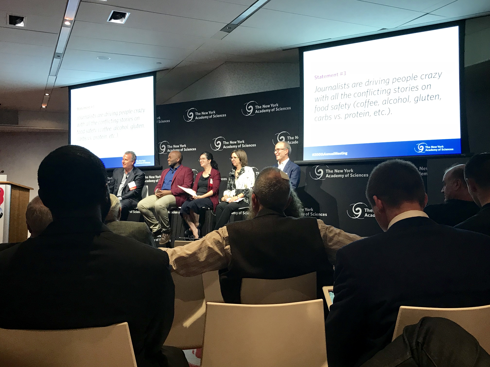
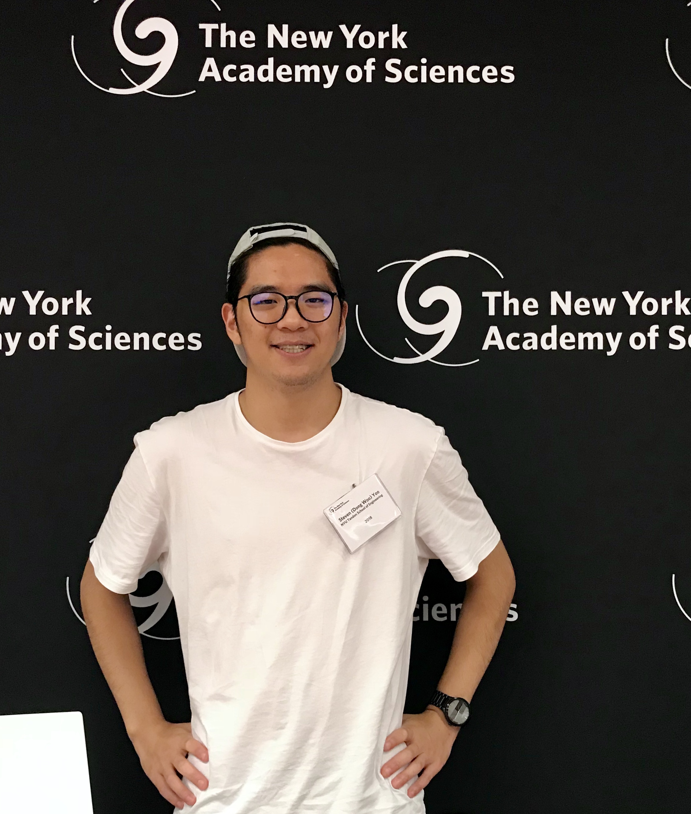
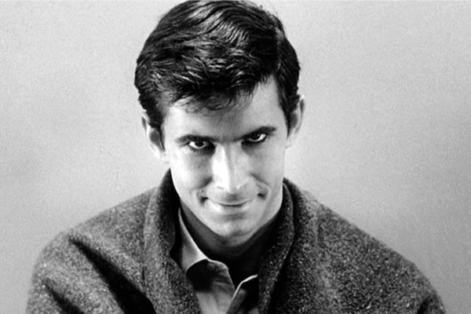
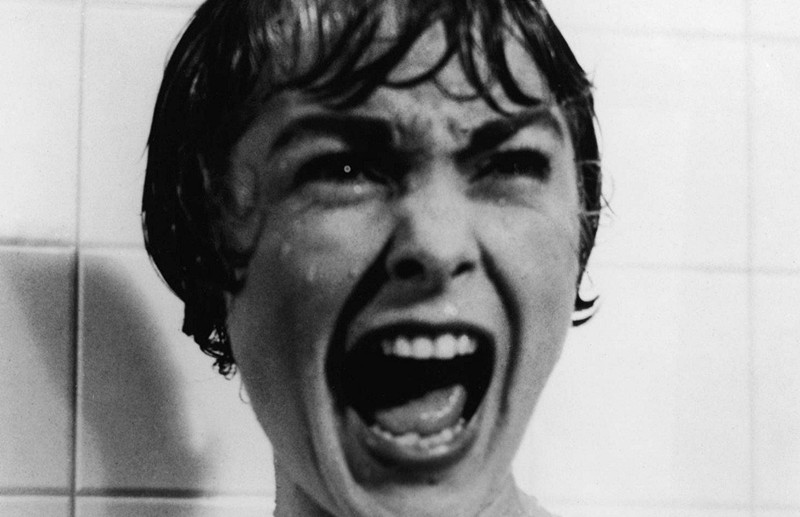
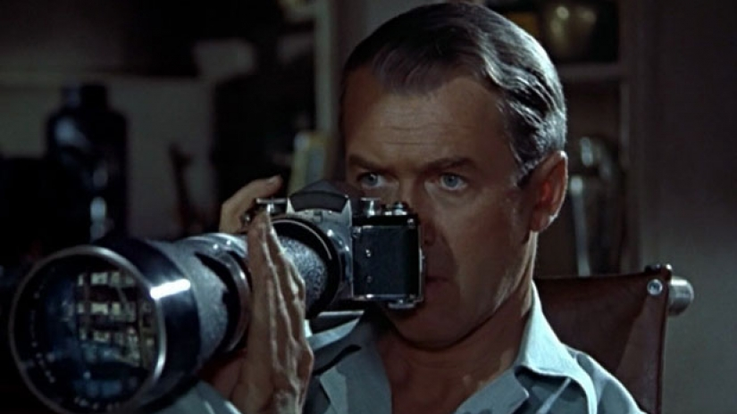
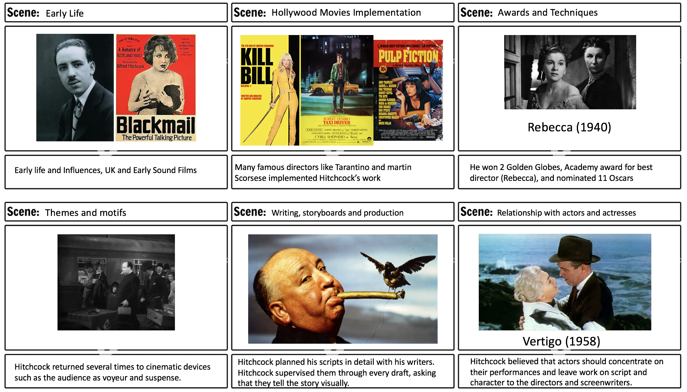

# Week 4!

### Discovery Log Week 4: New York Academy of Sciences!

The New York Academy of Sciences was founded in January 1817. It is one of the oldest societies in the U.S. An independent, non-profit organization with more than 20,000 members in 100 countries, the Academy's mission is "to advance scientific research and knowledge; to support scientific literacy; and to promote the resolution of society's global challenges through science-based solutions"

I was privileged to attend the Academy's 200th Annual Meeting and Welcome Reception on Thursday, September 27th, 2018. There was an interactive panel discussion exploring questions at the intersection of science and journalism. For example, how can the media convey the wonder and enormous potential of scientific discovery? How do many researchers seeking to engage with a broader audience find  the right balance between scientific accuracy and public accessibility?

I have discovered and found that there are many societies and organizations around the world \(and NYC, of course\). I highly value developing meaningful relationships with others. Having  that networking and has a possible alumni network as a resource for finding jobs and career opportunities. 

Cheers!

Steven Yoo  

### Alfred Hitchcock! - Research Paper

**Videos:** 



**Psycho:**



**Rear Window:**



Hitchcock looks right at the audience in a way that makes people think he broke the fourth wall. It's also slightly unusual in that his cameo appears nearly 30 minutes into the movie. Although he waits that long to appear in several of his films.

#### **Images:**

  
**Biographies:**

  
**Writing with Hitchcock: The Collaboration of Alfred Hitchcock and John Michael Hayes**   
by Steven DeRosa **Link:** [http://a.co/d/7aCrHPA](http://a.co/d/7aCrHPA)  
  
**Alfred Hitchcock: A Life in Darkness and Light**   
by Patrick McGilligan **Link:** [http://a.co/d/3KMMrAz](http://a.co/d/3KMMrAz)  
  
**Alfred Hitchcock**   
by Peter Ackroyd **Link:** [http://a.co/d/hQhbi9P](http://a.co/d/hQhbi9P)

### Storyboard Draft!

### Documentation of Tools and Techniques

For this week's assignment, I will have a storyboard draft for our documentaries and making Hitchcock's creative storyboard and production techniques. He influenced a lot of current Hollywood directors like Marin Scorsese and Quentin Tarantino. It would be very interesting to see some sort of mashups of Hitchcock's movies and other Hollywood directors' movies collaborate together and possibly create something that is very unique from its own! 

#### Possible Outline \(Subject to change\)

**I. Introduction: Hitchcock’s early influence \(i.e. Background, education\), Early Hollywood Movie Influence.**

**II. Background/Influence to create each of these movies \(how much $$, who were involved, books? Silent movies?\) for all 5 movies.** 

**III. What makes his new movie techniques so influential and why did he have to use it?** 

**IV. Today’s Hollywood movies and directors Influence \(Stan Lee...etc.\)**  

  

### 

