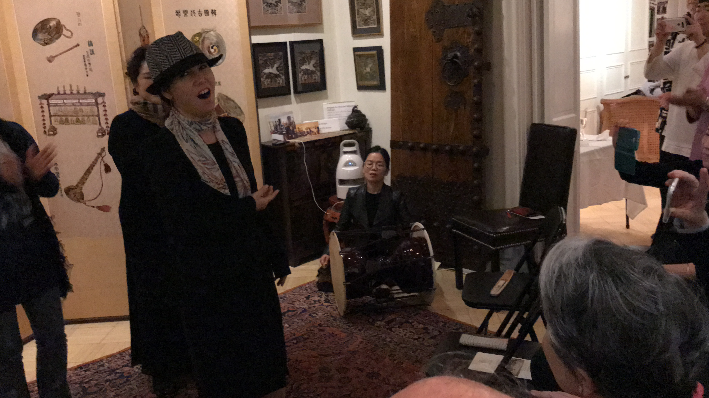
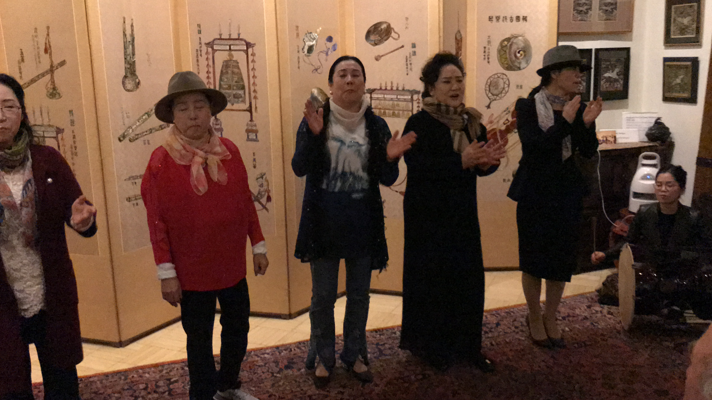

# Week 5!

### Seol Won Foundation Party and Korean Pansori Group



After 2 weeks of conferences \(New York City Media Lab and New York Academy of Science\) . I had an opportunity to help my grandmother with her non-profit educational organization "Seol Won Foundation" Link: [http://www.seolwonfoundation.com/](http://www.seolwonfoundation.com/). The Seol Won Foundation focuses to bridge cultures East and West through scholarly exchanges, lectures, research, and vocational training for all age groups and levels of expertise. Korean Pansori Group \(Link: [https://en.wikipedia.org/wiki/Pansori](https://en.wikipedia.org/wiki/Pansori)\)  Pansori is a Korean genre of musical storytelling performed by a singer and a drummer. Here is a quick YouTube video that describes what Pansori is: 



It was a great to bring traditional Korean folk singers to this party and allow me to listen to their beautiful performance. Frankly, this was my first time ever watching/listening to the live Pansori performance. I didn't anticipate to experience this amazing Pansori in United States. I learned and discovered that it is important to know and appreciate your ethnicity and culture. As an Asian American, I often forget about my Korean heritage and emphasizes on my American identity. It is something that many future Asian American people should be proud and understanding the particular \(in this case: pansori\) performance. Asking yourself, where is the creative process behind "Pansori"? How did it start?

I have attached some images from the event:

 Cheers!

Steven Yoo

