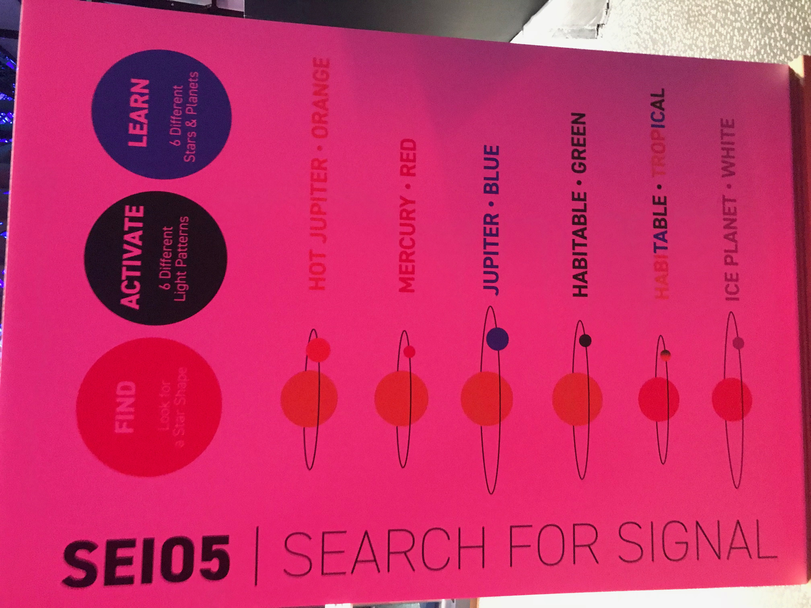
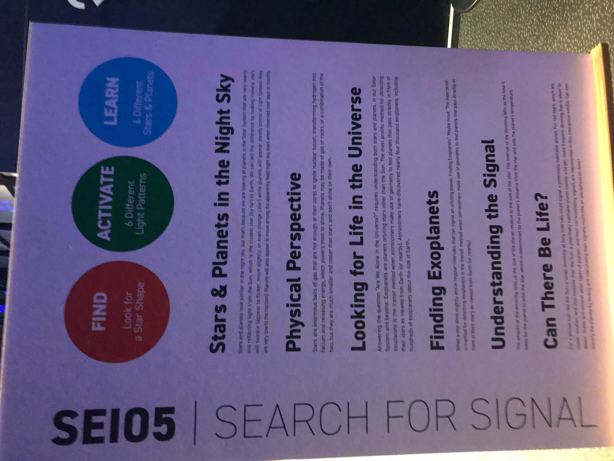

# Week 6!

### Discovery Log Week 6: Self-Guided Tour of NYSCI \(New York Hall of Science\)

I really enjoyed the NYSCI Self-Guided tour! The last time I came here was around 2008! \(So about 10 years or so\). It was really awesome to see how new technologies has changed the NYSCI programs.

Here is my video for my trip! Enjoy :\)



**Connected Worlds**

Connected Worlds is an interactive ecosystem developed for the New York Hall of Science. The installation is composed of six interactive ecosystems spread out across the walls of the Great Hall, connected together by a 3000 sqft interactive floor and a 45ft high waterfall.

Children play around with a virtual-reality water in the system and have to work together to control and deliver the water across the different environment settings. Virtual clouds return water from the environment settings to the waterfall which releases water to the floor when it rains.

**Mathematica**

Mathematica displays the range of mathematics and uses a time-tested collection of exhibits to share the excitement that mathematicians find in pursuing their science. Through a combination of hands-on activities and dynamic models, visitors are invited to explore how math has impacted so many facets of our contemporary world, from the devices we carry in our hands to the changes in social sciences, art, music, and architecture.

#### Conclusion:

I was able to think and learn more about the technology changes \(2008 vs. 2018\) and how interactive design is important to our current and future society. Ultimately, a good user experiences is allowing the flow as natural as possible and that the users need not think what to do next. That is, processes should be intuitive to the users. As more interactive and creative technology evolves, we will be able to create new innovative artwork and promote young kids and adults to find their passion.

Cheers,

Steven Yoo

