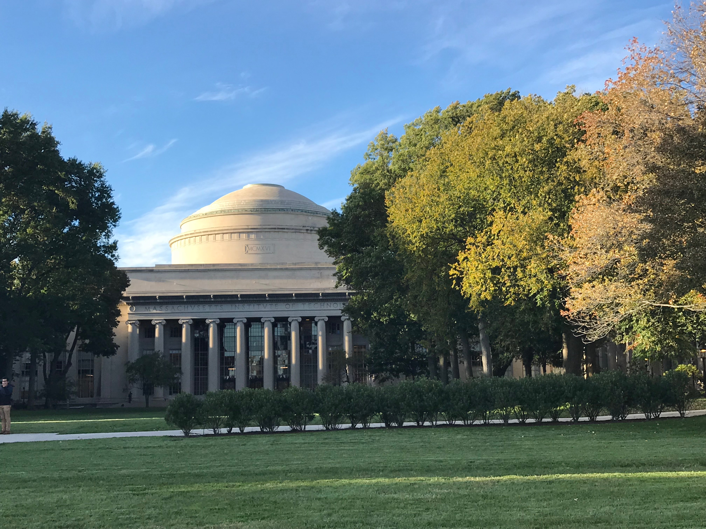
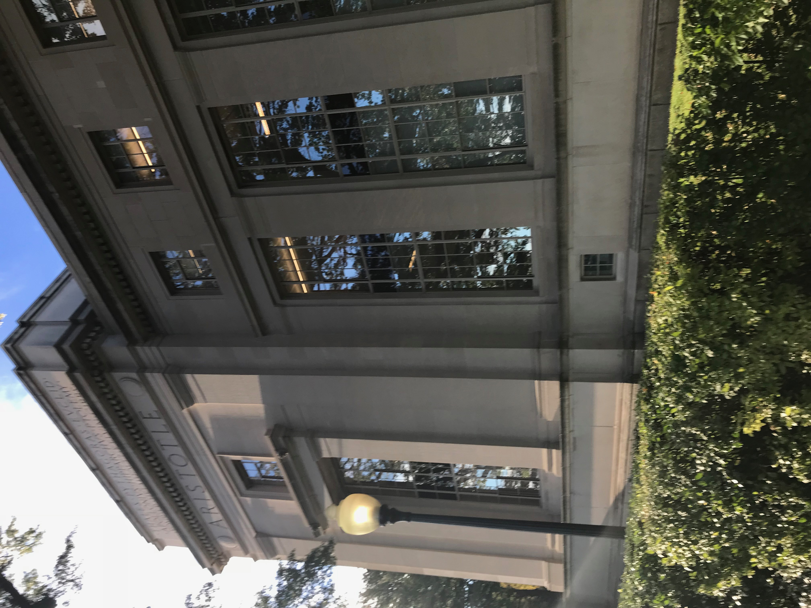
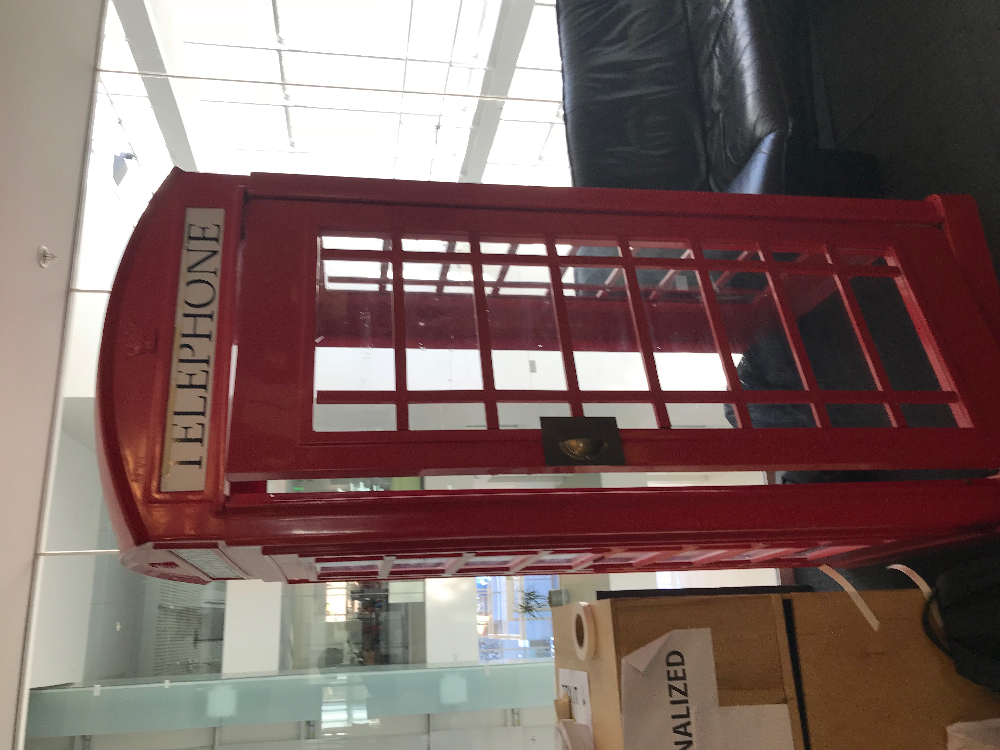
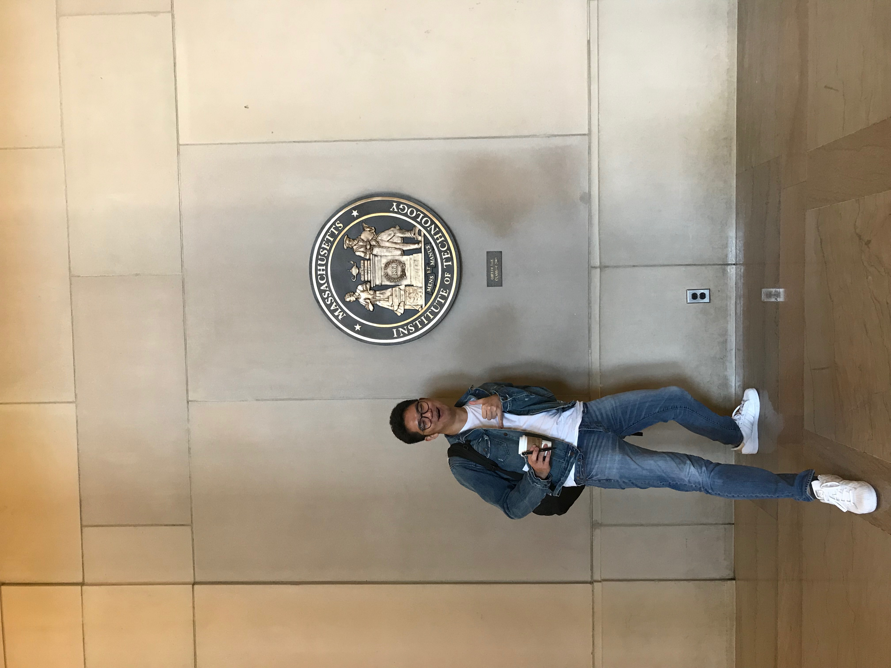

# Week 7!

### Discovery Log Week 7: MIT CREATE TOUR

For my week 7 discovery log, I went to \(MIT\) [Massachusetts Institute of Technology](http://www.mit.edu/). 

MIT CREATE works to advance methods and solutions that enhance urban development for informal and non-standard economies towards smarter, more equitable urban development. The MIT CREATE's vision is pursued through education, action-oriented research, and projects with a variety of stakeholders.

Furthermore, MIT CREATE is focuses to several global trends, including urban, migration, income inequality, and quality of life disparities. I will be working as a data visualization person.

**Here are some pictures that I have taken during my MIT tour.**

  
****

**Why is it meaningful?**

To be honest, this was my first time visiting MIT campus. It is arguably one of the best engineering schools in the world. Walking around the campus and engaging with faculties and students gave me a lot of remarkable memories. It motivated me to success and meet other organizations and people to discover your worth and your asset.

