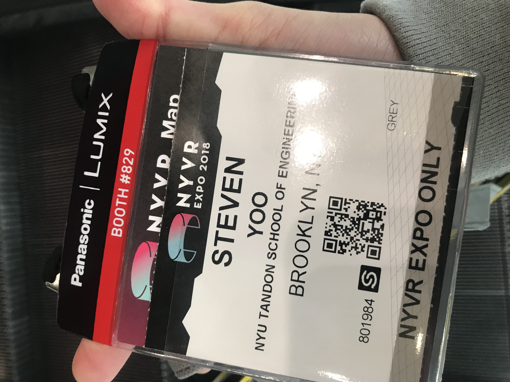
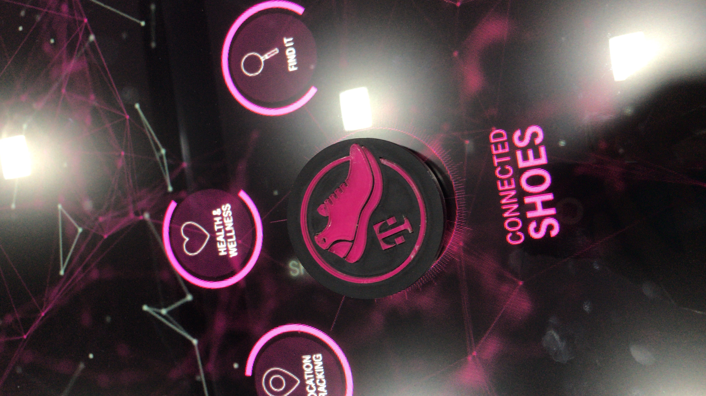
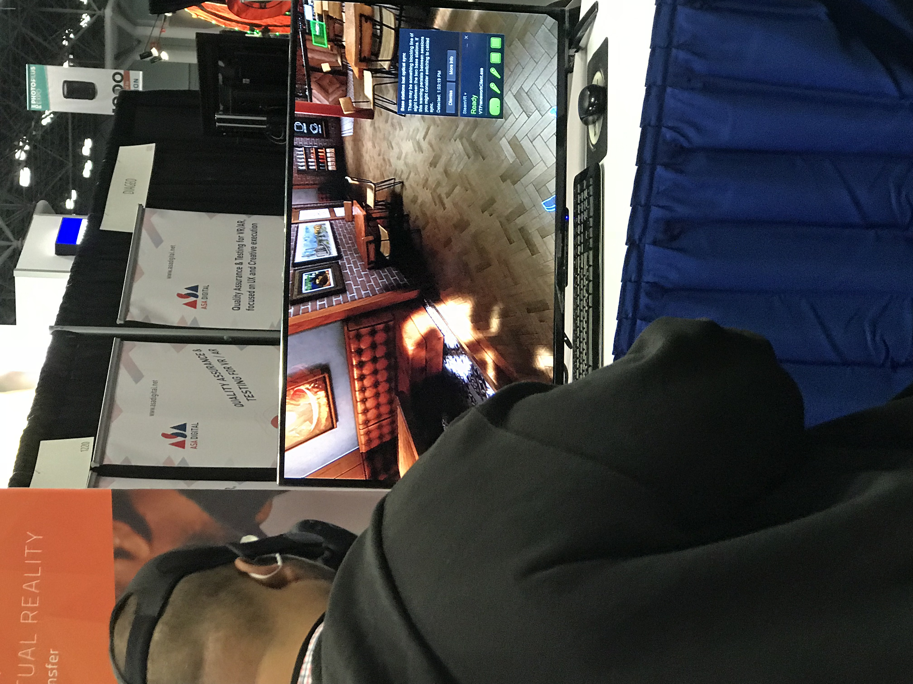
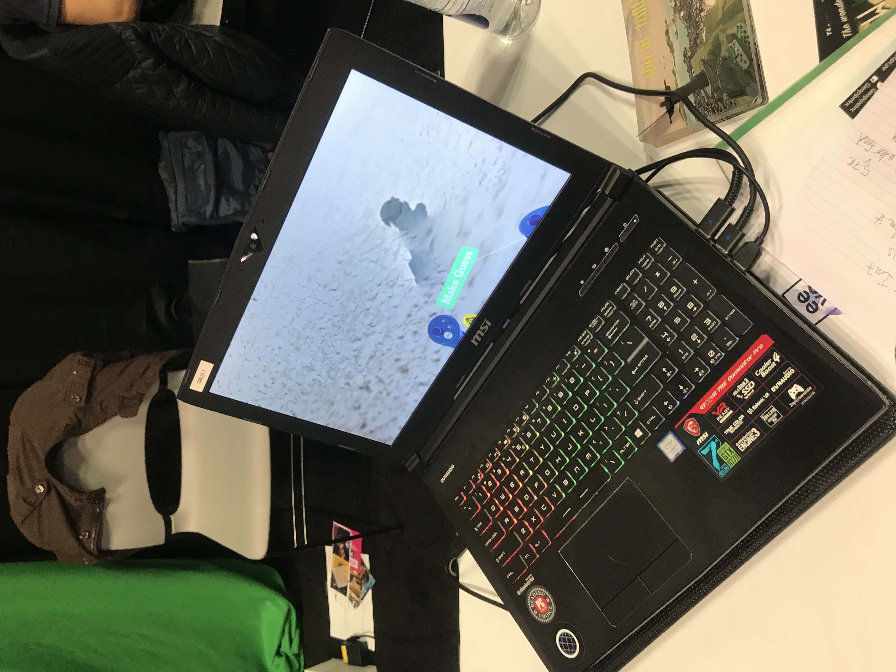
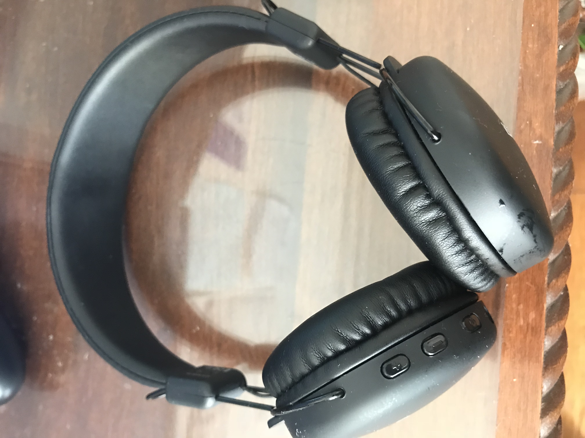
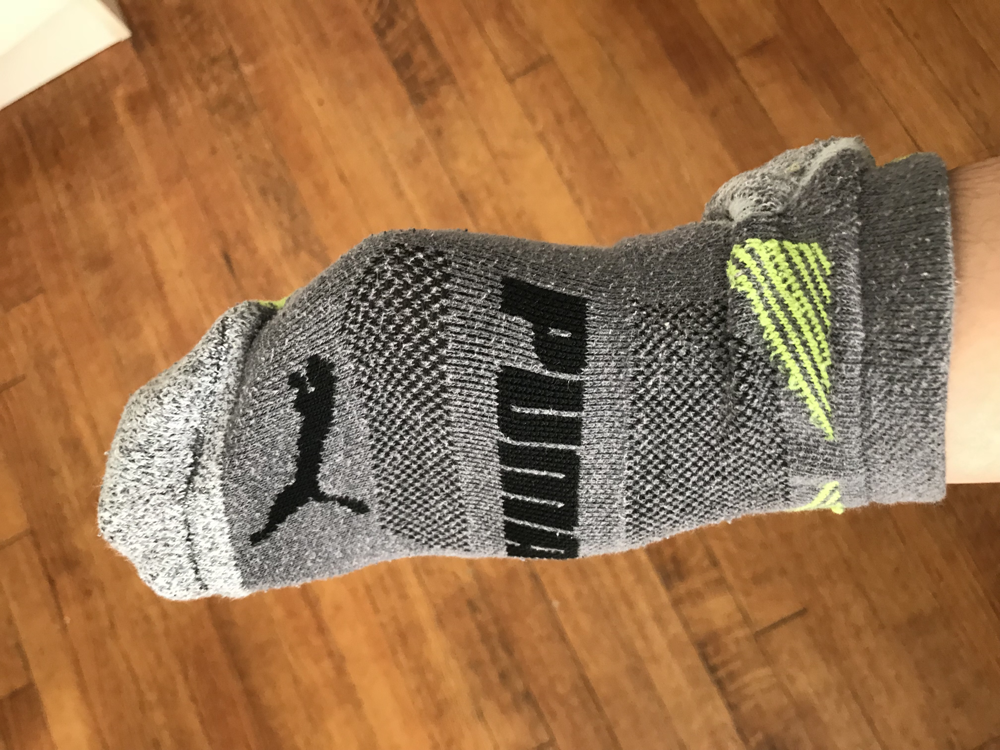
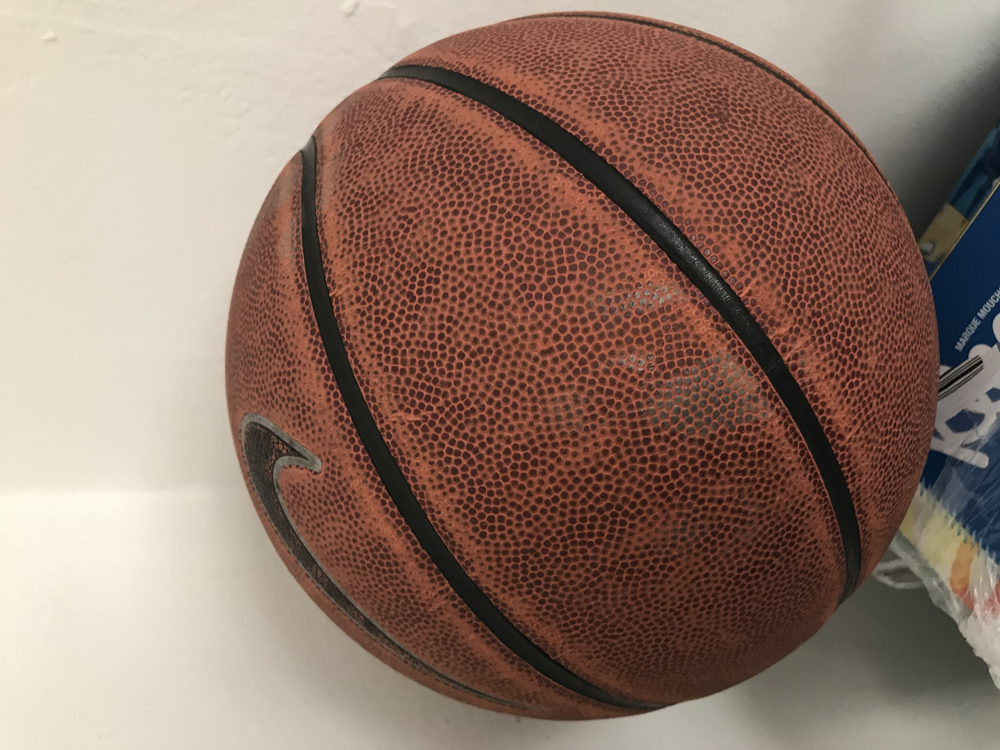
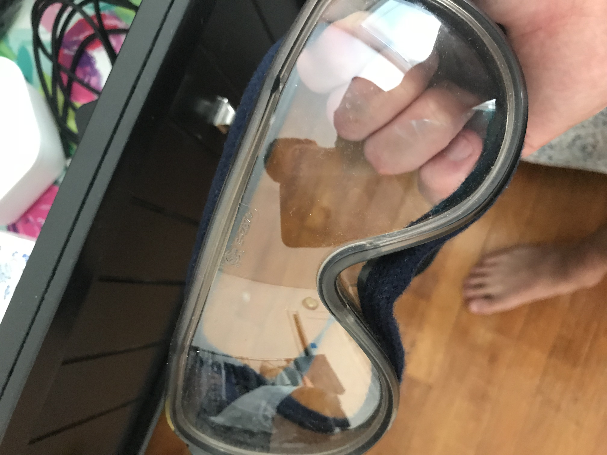

# Week 8!

### Discovery Log Week 8: NYVR EXPO

NYVR is an event that the best and brightest individuals in the industry pushing the boundary of possible, showcasing the latest virtual reality products, augmented experiences, and groundbreaking hardware. NYVR was held at the Javits Center, October 25-27, with more exhibitors and a renewed focus on education and visionary perspectives from thought-leaders.

**What have I discovered?**

The NYVR exhibit hall features the most forward-thinking companies in the space. I learned through experience with hand-crafted virtual education programs and saw live demonstrations of hardware. I spoke with the experts and creators making the tech that is going to reshape the way we live. I learned about the latest development techniques and business strategies in the 45+ sessions and panels at NYVR. Attendees will get a 30,000 ft. view of how businesses from every sector are utilizing VR/AR to enhance their products and educate consumers. Many developers and creators will get to take a focus into the platforms and tools they need to capture and share experiences or design entirely new worlds from scratch.

I was able to meet with forward-thinking developers, creators, and professionals in the advertising, leisure, education, media, healthcare, and retail industries. As the largest XR show on the East Coast, NYVR draws attendees from field unique to the area with an increased focus on business built on a bedrock of culture and creativity.

###  Ira Glass on storytelling


**Discuss any epiphanies or insights that occurred while watching, how it reflects your own process \(or does not and why\) or how it will inform or change your own process \(or will not and why\).**


#### [https://www.youtube.com/watch?v=5pFI9UuC\_fc&list=PLE108783228F1E008](https://www.youtube.com/watch?v=5pFI9UuC_fc&index=1&list=PLE108783228F1E008) \(Part 1\)

Ira Glass mention some great points. I really like what he said about the "anecdote power". He described it as a "momentum in itself makes it interesting" or raise questions \(Moment of reflexion\). A good story need both interesting anecdote and moment of reflexion. Similar to my paper, Alfred Hitchcock, giving a minimal information to create a suspension to the story is good idea. Personally speaking, I speak a lot and find very loud a lot of social settings. I am currently trying to fix my loudness and see if my social interaction will change or not. I would love to my creative process changing due to my new social behavior. I think it will create natural suspend or raise questions to the readers.

### [**Future Dystopia / Utopia Project**](https://deangela.gitbooks.io/dm-6053-ideation-and-prototyping-spring-2017/content/future.html)


**Find 4-5 simple objects on the street, in a room, or in a drawer, etc. Place them in new contexts, combine them, play with them, misuse them -- What new ideas are suggested? Document on your process website.**


  
**Actual usage: Listening to your favorite songs without any cable.**

**Misuse & Suggestion:** 

* Use it as an earmuffs for your upcoming cold winter season.
* Use it as a noise cancelling headphone for your annoying friends and strangers.

**Actual usage:**  A sock is an item of clothing worn on the feet and often covering the ankle or some part of the calf.  In cold environments, socks made from wool insulate the foot and decrease the risk of frostbite.

**Other usages and suggestions:** 

* Become a best friend with your sock\(s\). He/She will warm you up all year around.
* Use it as a glove. See example above. It is clearly protecting my hand from the cold weather and safe.

**Actual usage:**  A basketball ****is a ball used in basketball games

**Other usages and suggestions:** 

* Become a best friend or foe with your basketball. He/She will keep you active all year around or not motivate you to work out and regret during your summer beach time.
* Use it as a weapon. Only one time use! You will need to have a good aiming skill and some arm strengths to effective hurt your foes or friends.

**Actual usage:**  Laboratory Goggles ****are forms of protective eyewear that usually enclose or protect the area surrounding the eye in order to prevent particulates, water or chemical from striking the eyes.  

**Other usages and suggestions:** 

* Brag about your new and awesome laboratory goggles to your friends and family. Tell them that it will be "cool" in 20 years from now. With the rapid climb changes and chemical warfare, mind as well prepare for the worse case.
* It will be a lot comfortable to wear it in the future. Perhaps, it will be new design model for "Google Glasses", where you can access any information through your googles and also serve as a regular eyeglasses \(to improve and assist your sight\) . 

#### 

