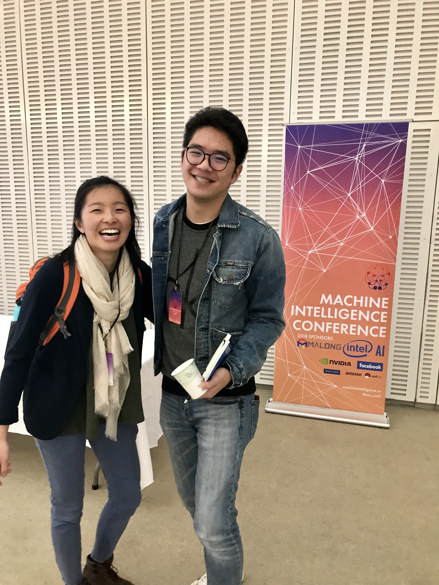

# Week 9!

## **Brainstorming**

**Dystopia Theme: Living on post apocalyptic environment**

**Background**

Have you ever wondered what it would be like to live on **post apocalyptic environment**? Will our planet uninhabitable soon enough? 

Scientists from Oxford University's Future of Humanity Institute and the Global Challenges Foundation have compiled the first research on the topic, listing few possible ways that human civilization might end.

Notably:

**Nuclear war:** The possibility of a deliberate or accidental nuclear conflict in the next century or so is estimated at 10%. The larger impact would depend on whether the conflict would trigger a “nuclear winter” – a climatic effect that would plunge temperatures below freezing, destroy most of the ozone layer, and start firestorms, which would likely lead to mass starvation and state collapse.

**Climate change:** The report warns that climate change could be more extreme than some estimates suggest. The world's poorest countries could become completely uninhabitable. Climate change could lead to mass deaths, famines, social collapse, and mass migration.

## **Storytelling**

Over 97% of scientists agree that global climate change is real. It is even predicted that some parts of the Earth will be uninhabitable by the end of the century. Yet we humans still refuse to act on any significant change. Along with multiple nuclear wars, it would drop temperatures below freezing, destroy most of the infrastructures and food sources.

These characters living in a decimated landscape. Crops catch fire spontaneously, dust storms are on the rise, and humanity relies on primitive food, power, water, basic human resources. 

In this dystopia society, We have to live on post apocalyptic environment. Finding basic needs like food, clothing and shelter would be extremely difficult to find in this place. Food agriculture system would be destroyed and would have lack of basic resources like food, water, and shelter. 

**Some older generation** humans will have to wears the special radiation free **suit** and **mask** due to their weaker immune system and health. However, younger generation will be free to go outside and has a strong immune system. There would all be old rundown buildings and barely no plants around the area. There is no government and it has created a anarchy nation that has no system of central rule or government. There would be no punishment for crimes \(like Purge\). Life would turn into survival of the fittest.

## **Prototyping/Visualizing Tool**

Project Type: Virtual Reality \(VR\)

Potential Tool: Unreal Engine 4

Form: Video Visualization 

Infrastructure Components: Dusty air, collapsed buildings and infrastructures, polluted water and toxic wastes. 

### Discovery Log Week 9: MIT MIC \(Machine Intelligence Conference\)

Last week I went to the the Machine Intelligence Conference \(MIC\). Their mission for this conference is to democratize machine intelligence, promote diversity, build community, and inspire the next generation of researchers and engineers.

The idea behind the Machine Intelligence Community originated from the MIT Machine Learning Reading Group. The reading group started with students looking for an environment to learn about research advances in machine learning.

The Machine Intelligence Community has a set of core values it stands to uphold. All Machine Intelligence Community organizations must uphold these values.

1. **Openness**. The Machine Intelligence Community is inclusive and diverse.
2. **Education**. We aim to provide surface area for intellectual engagement. Our primary focus is teaching members and the community at-large about machine intelligence.
3. **Community**. By doing this, we hope to cultivate and connect communities and like-minded students to accelerate progress in machine intelligence.

**Facebook: Machine Learning Applications in mapping and satellite image processing:**

Automated Pattern Recognization in Satellite Imagery Analysis ****

  
****Scene Segmentation in Remote Sensing Data

  
Video Link: [https://code.fb.com/core-data/connecting-the-world-with-better-maps/](https://code.fb.com/core-data/connecting-the-world-with-better-maps/)  
Wiki: [https://wiki.openstreetmap.org/wiki/AI-Assisted\_Road\_Tracing](https://wiki.openstreetmap.org/wiki/AI-Assisted_Road_Tracing)

**What did I discover?**

For the past 2 years, I was part of the Machine Learning/ AI research group at my undergraduate institution. It was a good educational trip to bring back my AI knowledge to my daily coding skills. I believe that Machine Learning or Data Science will be used in my thesis project. Whether large or small scale. I do not want to discard my previous learning into garbage. I think NYU-X Lab's Holodeck project will be needing data analysis or at least data visualization components. For the next semester, I want to be familiar with VR/AR software and hardware tools so that I can be: 1\) a versatile engineer 2\) a great contribution to the project. I have a feeling that I am one step closer to finding my passion.

Cheers,

Steven Yoo

