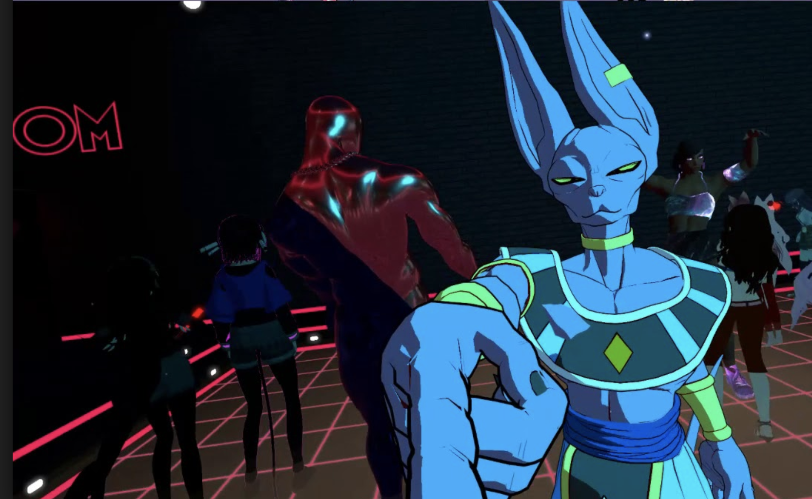
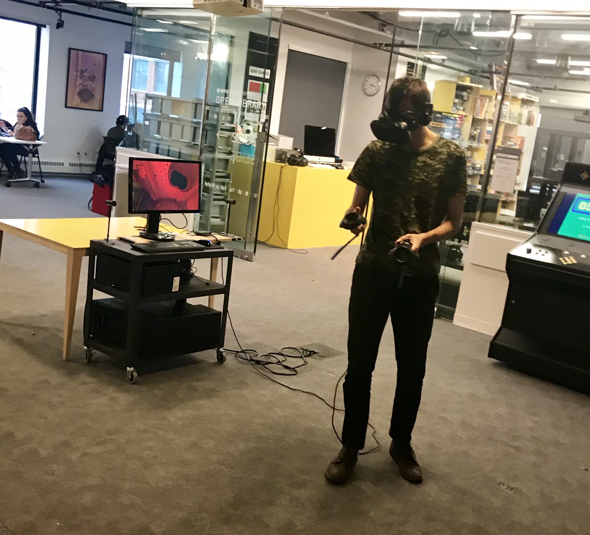

# Week 2


**Assignment: Technical Exercise - Explore the interface of Unreal.  Create a scene only using assets from the Starter Content plus 5 other assets migrated from other Unreal projects found on the Learn tab of the Epic Games Launcher. Take 3 hero shots \(“HighResShot 4”\) and post to your blog with a brief description of your scene. Put your blog link in the \#week02 channel.**

**Play “The Lab” and “VRChat” on Steam. Include your thoughts on the experience in your blog post.**  


I decided to experiment and play around the assets and the materials in Unreal engine. I created assets from the start content and the outdoor landscape. It is really cool to see how we can create game engine content and I want to build my UE4 skills to make my own game or simulations.

#### VR CHAT

VRChat is a social network that allows players to interact with each other in real time. All players are shown as 3D models in the game. My best friend borrowed me his VR sets and VR Chat. I really enjoyed my experience and I was able to communicate with people around the world!

#### The Lab

The Lab is a VR game where is based on Game: Portal. The eight minigames show different types of VR functionality. It’s a good experience for a beginner to learn basic operations and how to play games. My favorite minigame is Xortex box, a bullet hell type game, I really enjoyed in such a small space and fired to enemy ships. The visual style is also beautiful. I would recommend this game to anyone!  

#### BONUS

I found a person testing his VR game. :\)

