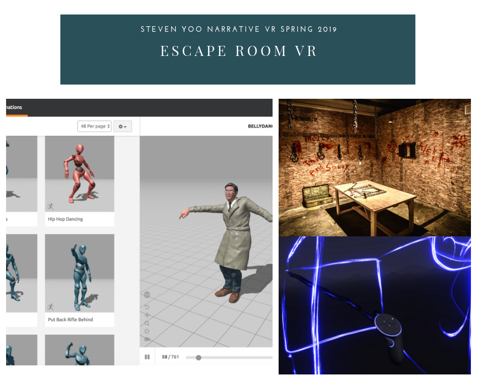

# Week 3


**Assignment: Design a new world based off of the readings we did on the UX of VR.  Explain some of your design choices in your blog post.**

* **Create a mood board for a new world and a character that would live in that world and start trying to storyboard some ideas.**  
* **Use Quill, Tiltbrush, and Medium to help you storyboard ideas.**  
* **Build a new complete environment in UE4 with a First Person and/or a VR Pawn with at least two interactions.**  
* **Post video capture of your interactions onto your blog and put the link to your post on the Week 3 Slack channel**


### Possible VR Environment

### Storyboard

In my storyboard, I want to tell a story where a man is trying to \(scary\) escape room from the random storage room. The main character will be looking for clues and items to find an escape plan from the kidnappers \(Possibly Zombies\). There will be multiple options to escape from this room. It will be single-player solo given a specialized gun. I will be coming up for more design ideas and gameplay design \(i.e., Level Difficulty, Finding Music Scores, and Model designing\). 



### Tilt Brush

I used Tilt Brush at the Black Box studio. It was really awesome VR software to initialize basic ideation tool. I tried to create a 3D box to see if I can bring this 3D mesh into Unreal Engine. I am planning to use different box models. It is probably better idea to borrow existing libraries. 

### Constraints

* My MacBook Pro is crunching my CPU power and still having some problem with metal textures and mesh import.
* In the future, I'll upload my files from Blackbox computer or my home desktop.

### Next Steps

* Updating my storyboard and keep working on narrative contents
* **Try importing my Tiltbrush assets into Unreal Engine**
* Build my main character and its storyline

Cheers,

Steven Yoo

