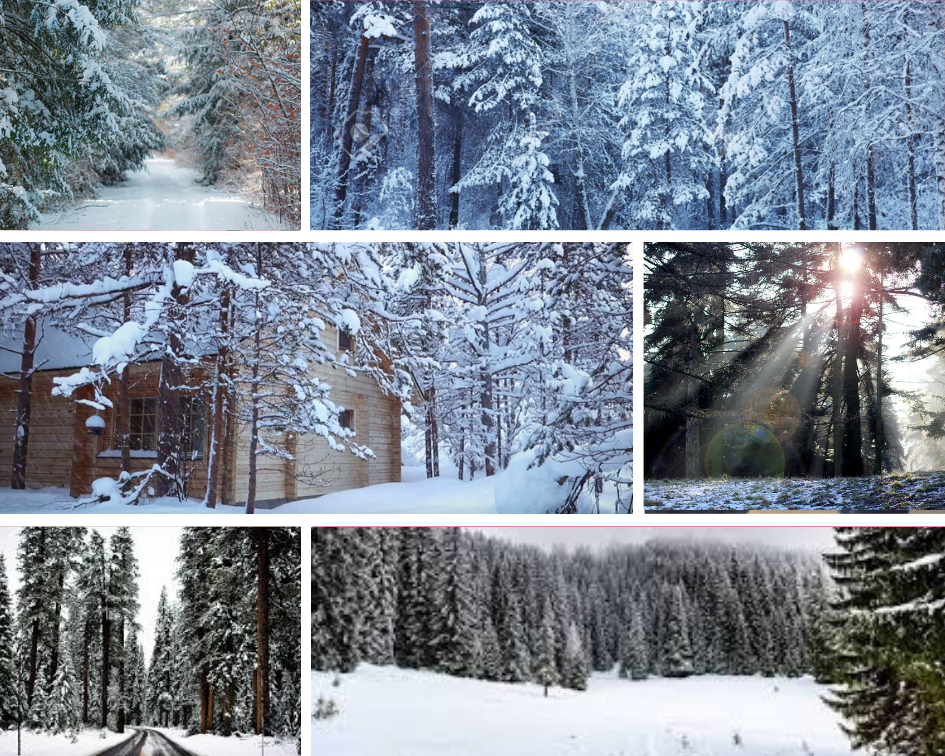
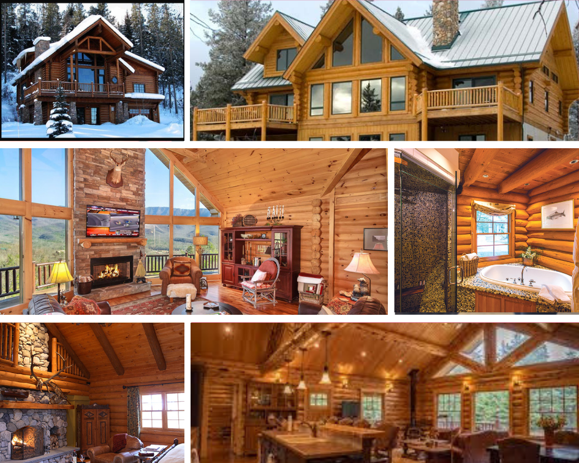

# Week 4

For the midterm project, I want to create a cold wintery snow forest environment and log cabin home narrative story.

### Snow Winter Forest

I want to create an environment and an aesthetic narrative story to let players to enjoy and appreciate the winter forest and wildlife. Many people wants to stay under their blanket and not doing anything at all and that is so boring and depressing. I understand why people don’t like winters and drink hot chocolate or have the opportunity to stay under their covers because it is not all such a nice feeling if we consider the factors leading to this.

### Story Outline

I want to start my narrative story to begin with WASD controlled with sit-down environment. The player will have freedom to access both winter forest and log cabin home. Adding wildlife animals and casual skiers and snowboarders and maybe adding your future boyfriend or girlfriend on a trip together.

### Log Cabin

Log cabin homes are very comfortable and they are a rustic place for your friends and family members to meet and relax. This building method can also be used as a garden office, a sitting room, a guest room or a summer-house. One should also remember that having a log cabin in your garden can be a charming accessory to add.

### Google Tilt Brush

I tried to attempt to make it more snowy environment and creating three friends in the Tilt Brush environment. I am not currently sure whether if I want my story to be about friendship or two couple.



### VR EXPERIENCE

### INVASION!

INVASION is a VR application about a two of aliens with great plan to take over the earth and attempt to destroy anyone who tries to stop them. Instead, they are greeted by the cutest and cuddliest animals on the planet - two adorable, white bunnies….and you are one of them! Because of tall height, the other bunny was about 5'5". Haha.

### Passage

I was really confuse when it comes to following this storyline. I really appreciate the retro-like and 8-bit game. This game was so emotional as the game progress... SPOILER ALERT.... his wife dies in the end.

### Fall in Love

I would like to say that technical development was very poorly designed. It has to be position perfectly with your VR person otherwise, it will temporarily pause the game and would not able to process the VR narrative. In narrative perspective, It was okay... they could have included more meaningful questions.

### Evolution of Verse

Evolution of Verse is a short VR film that takes viewers on a journey from one beginning to a new beginning. I was actually inspired by this VR film that based upon my midterm narrative VR story. I really enjoyed wild nature and aesthetic views of this environment.

Cheers,

Steven Yoo

