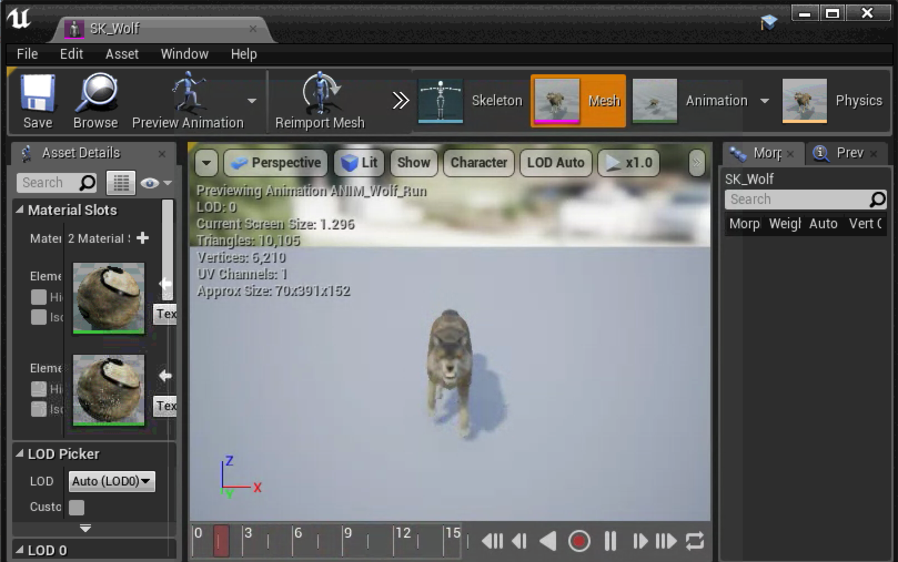
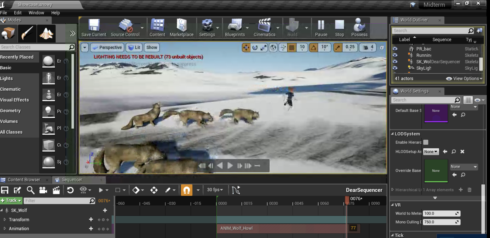

# Week 6 - MIDTERM


**Assignment: Finalize your midterm projects and be prepared to present the project to the class.**  

**What was the initial idea?**

**How did your mood boarding and storyboarding change that idea?**  

**How did the medium and it’s tools shape how your told the story? How did it facilitate / How did it hinder the story?**

**Where would you take this project if you had more time/resources?**

**What would you do differently if you had to start the project over from scratch?**

**Why are you going to or not going to stick with idea?**  


### What was the initial idea?

My initial idea was to create an escape room and wintery forest theme with wild animals. I decided to create both log cabin and wintery forest. I want to incorporate with both of them in one scene. A boy getting chase down by wild animals \(Wolf and Deers\). 

### How did your mood boarding and storyboarding change that idea?

Mood boarding and initial storyboarding definitely changed a lot due to limitation of my personal skills. I really had a very difficult time to learn and spend few hours to learn animation technique. So I had to really simplify the process. However, the whole concept of mood boarding and storyboarding allow myself to visualize the narrative story.



### How did the medium and it's tools shape how your told you story? How did it facilitate/ How did it hinder the story.

I was always intrigued what it likes to be chase wolves in real life. Since this method is significantly dangerous to act upon. I decided to make as Virtual Reality piece.

### Where would you take this project if you had more time/resource?

I would love to include background sound and adding wolf howling and barking noise. As well as spending more time with adding a house.

### What would you do differently if you had to start the project over from scratch? AND REFLECTION.

More concrete narrative story buildup and not just utilizing a scene. I have realized that it would be advantageous if you have some backgrounds on After Affects and Fuse or any 3D rendering tool techniques. Also if you do not have strong computing power, it would be very time consuming and can be very frustrating at a time. I am not sure if I want to continue this project. It is certainly interesting to explore any thrilling/fear narrative stories. 

### MIDTERM - YOUTUBE



Steven Yoo

