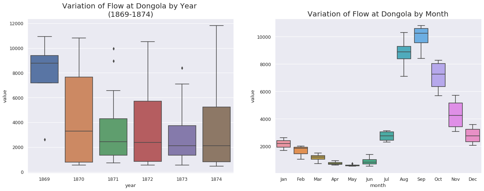

# Valen Lab

### Given Dataset of Nile overflow data


```text
 Year  Jan  Feb  Mar Apr May  Jun  Jul   Aug   Sep  Oct  Nov  Dec
1 1869   NA   NA   NA  NA  NA   NA 2606  8885 10918 8699   NA   NA
2 1870   NA   NA 1146 682 545  540 3027 10304 10802 8288 5709 3576
3 1871 2606 1992 1485 933 731  760 2475  8960  9953 6571 3522 2419
4 1872 1672 1033  728 605 560  879 3121  8811 10532 7952 4976 3102
5 1873 2187 1851 1235 756 556 1392 2296  7093  8410 5675 3070 2049
6 1874 1340  847  664 516 466  964 3061 10790 11805 8064 4282 2904
```


\*\* The original data consists of average monthly flow measurements from January 1869 to December 1984. Which I couldn't get access to the full dataset. For this exercise, I used Jan 1869 to December 1874. 

From this mini data, 


```python
# Import Data
df = pd.read_csv('new_nile_format.csv', parse_dates=['date'], index_col='date')
df.reset_index(inplace=True)

#print(df)

# Prepare data
df['year'] = [d.year for d in df.date]
df['month'] = [d.strftime('%b') for d in df.date]
years = df['year'].unique()
x = df['year'].values
y1 = df.date
# Draw Plot
fig, axes = plt.subplots(1, 2, figsize=(20,7), dpi= 80)
sns.boxplot(x='year', y='value', data=df, ax=axes[0])
sns.boxplot(x='month', y='value', data=df.loc[~df.year.isin([1869, 1874]), :])

# Set Title
axes[0].set_title('Variation of Flow at Dongola by Year \n(1869-1874)', fontsize=18); 
axes[1].set_title('Variation of Flow at Dongola by Month', fontsize=18)
plt.show()

def plot_df(df, x, y, title="", xlabel='Date', ylabel='Value', dpi=100):
    plt.figure(figsize=(16,5), dpi=dpi)
    plt.plot(x, y, color='tab:red')
    plt.gca().set(title=title, xlabel=xlabel, ylabel=ylabel)
    plt.show()

plot_df(df, x=df.date, y=df.value, title='Monthly Flow of Nile River at Dongola Station (1869 - 1874)')
```





From the website: Long Memory and the Nile: Herodotus, Hurst and H. We can see that there is a similarity between variation of flow at Dongola Station by Month and Monthly Flow of Nile River Dongola Station.


### Limitation:

\*\* The original data consists of average monthly flow measurements from January 1869 to December 1984. Which I couldn't get access to the full dataset. For this exercise, I used Jan 1869 to December 1874. 

Series length must be greater or equal to 100 samples, due to small size of the data with 72 dataset. I wasn't able to produce Hurst Exponent.

#### Hurst Exponent

The goal of the Hurst Exponent is to provide us with a scalar value that will help us to identify \(within the limits of statistical estimation\) whether a series is mean reverting, random walking or trending.

The idea behind the Hurst Exponent calculation is that we can use the variance of a log price series to assess the rate of diffusive behavior. For an arbitrary time lag ττ, the variance is given by:

$$
Var(τ)=⟨|log(t+τ)−log(t)|2⟩Var(τ)=⟨|log⁡(t+τ)−log⁡(t)|2⟩
$$

Since we are comparing the rate of diffusion to that of a Geometric Brownian Motion, we can use the fact that at large ττ we have that the variance is proportional to ττ in the case of a GBM:

$$
⟨|log(t+τ)−log(t)|2⟩∼τ⟨|log⁡(t+τ)−log⁡(t)|2⟩∼τ
$$

The key insight is that if any [autocorrelations](http://en.wikipedia.org/wiki/Autocorrelation) exist \(i.e. any sequential price movements possess non-zero correlation\) then the above relationship is not valid. Instead, it can be modified to include an exponent value "2H2H", which gives us the Hurst Exponent value HH:

$$
⟨|log(t+τ)−log(t)|2⟩∼τ^2
$$

A time series can then be characterized in the following manner:

* **H&lt;0.5H&lt;0.5** - The time series is mean reverting
* **H=0.5H=0.5** - The time series is a Geometric Brownian Motion
* **H&gt;0.5H&gt;0.5** - The time series is trending

In addition to characterization of the time series the Hurst Exponent also describes the extent to which a series behaves in the manner categorized. For instance, a value of HH near 0 is a highly mean reverting series, while for HH near 1 the series is strongly trending.


```python
from hurst import compute_Hc, random_walk

# series = random_walk(99999, cumprod=True)
np.random.seed(42)
random_changes = 1. + np.random.randn(99999) / 1000.
nile_series = df.value.cumprod
#larger_nile_series = nile_series + 25.
print(random_changes)
print(df.value.cumprod) #Series length must be greater or equal to 100, Currently 72 due to the small size of the data.
series = np.cumprod(random_changes)  # change the variable with nile_series

#Setting up Hurst exponent

#print(df.value.len())
print(df.value.std())
print(df.value.mean())
#print(df.value.cummax())
#print(df.value.cummin())
#print(df.value.cumprod())

# Evaluate Hurst equation
H, c, data = compute_Hc(series, kind='price', simplified=True)

# Plot
f, ax = plt.subplots(figsize=(20,7), dpi= 80)
ax.plot(data[0], c*data[0]**H, color="deepskyblue")
ax.scatter(data[0], data[1], color="purple")
ax.set_xscale('log')
ax.set_yscale('log')
ax.set_xlabel('Time interval')
ax.set_ylabel('R/S ratio')
ax.grid(True)
plt.show()

print("H={:.4f}, c={:.4f}".format(H,c))
```



Any questions or concerns, you can email me here: steven.yoo@nyu.edu

Cheers,

Steven


