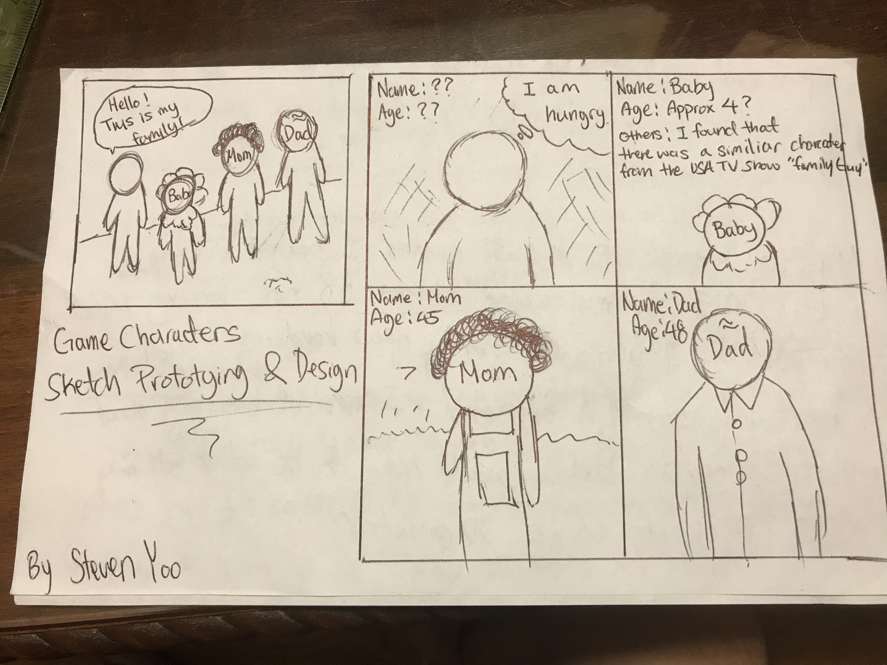
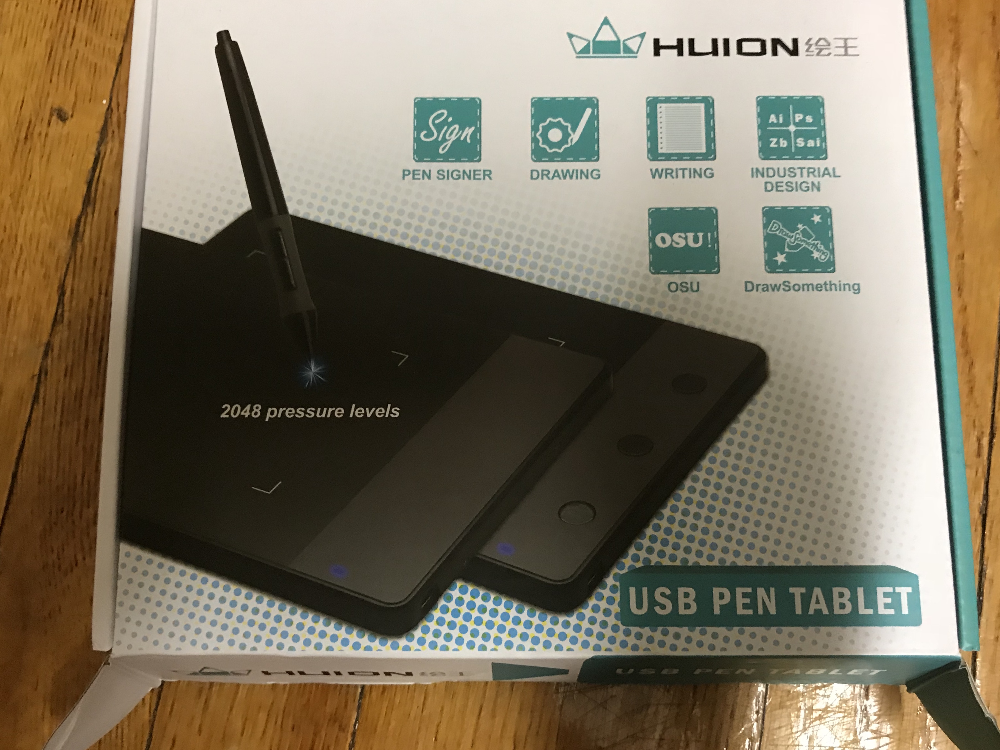

# Week 1!

## Inputs Map {#inputs-map}


Create a mind map or concept map of all of the various inputs in your life \(i.e. this is the total range of what comes into you from outside of your own imagination.\)

Post to your process website. You may have to upload micro and macro views of your map as images. You may also have multiple input maps.


## Personal Inventory

{% embed data="{\"url\":\"https://www.youtube.com/watch?v=JKn\_16Zfubg\",\"type\":\"video\",\"title\":\"Personal\_Inventory\_InP\",\"description\":\"NYU Fall 2018 InP\",\"icon\":{\"type\":\"icon\",\"url\":\"https://www.youtube.com/yts/img/favicon\_144-vfliLAfaB.png\",\"width\":144,\"height\":144,\"aspectRatio\":1},\"thumbnail\":{\"type\":\"thumbnail\",\"url\":\"https://i.ytimg.com/vi/JKn\_16Zfubg/maxresdefault.jpg\",\"width\":1280,\"height\":720,\"aspectRatio\":0.5625},\"embed\":{\"type\":\"player\",\"url\":\"https://www.youtube.com/embed/JKn\_16Zfubg?rel=0&showinfo=0\",\"html\":\"
<iframe src=\\\"https://www.youtube.com/embed/JKn\_16Zfubg?rel=0&amp;showinfo=0\\\" style=\\\"border: 0; top: 0; left: 0; width: 100%; height: 100%; position: absolute;\\\" allowfullscreen scrolling=\\\"no\\\"></iframe>
\",\"aspectRatio\":1.7778}}" %}

## Reading Response of Sketching: The Miseducation of the Doodle and The Visual Thinking Power Tool {#reading}


This is my reading response of the articles "The Miseducation of the Doodle and The Visual Thinking Power Tool".


 

During my young teenage year, I didn't want to be an artist. I wanted to make video games. Most of my artisitic interests at the time making Macromedia Flash application and drawing comic by sketch and pencils/pens. I think my art experience allow me to generate ideas, solving, problems, and visually communcating ideas more effectively. There is something special about the mix of thinking and handwork that enhances the ideas our brain process. As an engineer, it also reminded me that the value of sketching extends beyond design as a visualization tool for solving engineering problems.

I was raised in a family where both of my parents were an artist and a musician \(composer\). When I was 8, I'd always carry around my blank sketchbook and start drawing my own comics. I used draw comic book series \(Roughly 4 volumes\). Unfortunately, most of my sketchbooks were burnt and thrown away when I was moving to America. Essentially, I want to refine these characters and storyline to create an indie game.

## Discovery Log Week 1: Personal Technology Setup

