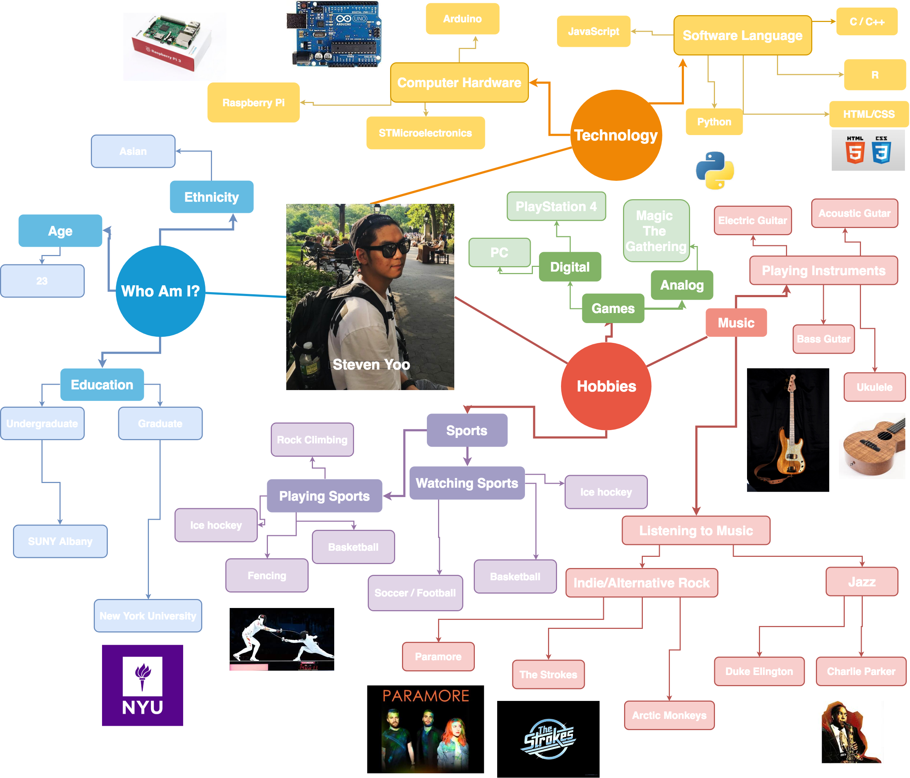

# Week 1!

## Inputs Map {#inputs-map}


Create a mind map or concept map of all of the various inputs in your life \(i.e. this is the total range of what comes into you from outside of your own imagination.\)+

Post to your process website. You may have to upload micro and macro views of your map as images. You may also have multiple input maps.


## Reading Response of Sketching: The Miseducation of the Doodle and The Visual Thinking Power Tool {#reading}

This is my reading response of the articles "The Miseducation of the Doodle and The Visual Thinking Power Tool".

During my young teenage year, I didn't want to be an artist. I wanted to make video games. Most of my artisitic interests at the time making Macromedia Flash application and comic. I think my art experience allow me to generate ideas, solving, problems, and visually communcating ideas more effectively.

I was raised in a family where both of my parents were an artist and a musician (composer). When I was 8, I'd always carry around my blank sketchbook and start drawing my own comics. Unfortunately, most of my sketchbooks were burnt and thrown away when I was moving to America.

