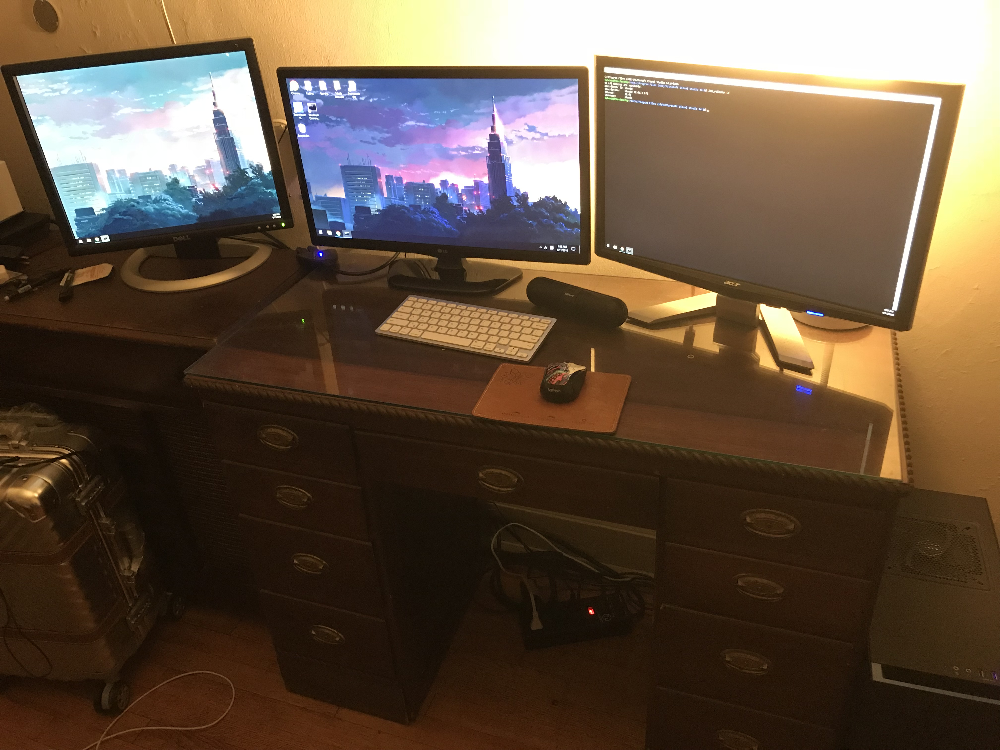
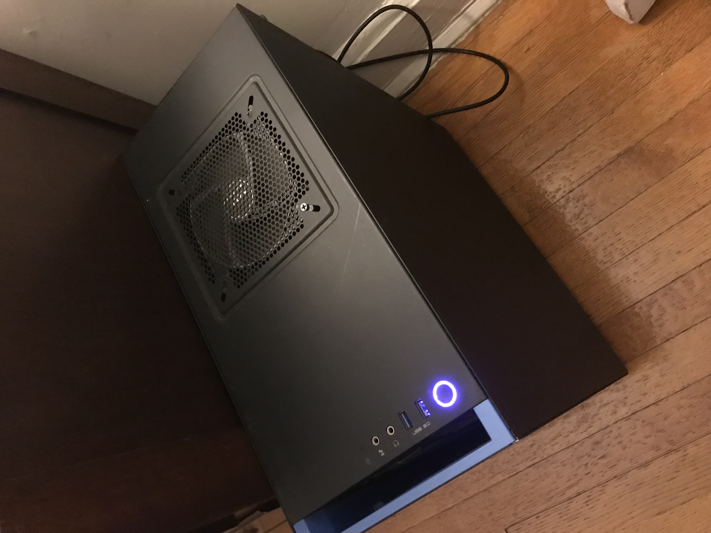

# Week 1!

## Inputs Map {#inputs-map}


Create a mind map or concept map of all of the various inputs in your life \(i.e. this is the total range of what comes into you from outside of your own imagination.\)

Post to your process website. You may have to upload micro and macro views of your map as images. You may also have multiple input maps.


## Personal Inventory

{% embed data="{\"url\":\"https://www.youtube.com/watch?v=JKn\_16Zfubg\",\"type\":\"video\",\"title\":\"Personal\_Inventory\_InP\",\"description\":\"NYU Fall 2018 InP\",\"icon\":{\"type\":\"icon\",\"url\":\"https://www.youtube.com/yts/img/favicon\_144-vfliLAfaB.png\",\"width\":144,\"height\":144,\"aspectRatio\":1},\"thumbnail\":{\"type\":\"thumbnail\",\"url\":\"https://i.ytimg.com/vi/JKn\_16Zfubg/maxresdefault.jpg\",\"width\":1280,\"height\":720,\"aspectRatio\":0.5625},\"embed\":{\"type\":\"player\",\"url\":\"https://www.youtube.com/embed/JKn\_16Zfubg?rel=0&showinfo=0\",\"html\":\"
<iframe src=\\\"https://www.youtube.com/embed/JKn\_16Zfubg?rel=0&amp;showinfo=0\\\" style=\\\"border: 0; top: 0; left: 0; width: 100%; height: 100%; position: absolute;\\\" allowfullscreen scrolling=\\\"no\\\"></iframe>
\",\"aspectRatio\":1.7778}}" %}

## Reading Response of Sketching: The Miseducation of the Doodle and The Visual Thinking Power Tool {#reading}


This is my reading response of the articles "The Miseducation of the Doodle and The Visual Thinking Power Tool".


During my young teenage year, I didn't want to be an artist. I wanted to make video games. Most of my artistic interests at the time making Macromedia Flash application and drawing comic by sketch and pencils/pens. I think my art experience allow me to generate ideas, solving, problems, and visually communicating ideas more effectively. There is something special about the mix of thinking and handwork that enhances the ideas our brain process. As an engineer, it also reminded me that the value of sketching extends beyond design as a visualization tool for solving engineering problems.

I was raised in a family where both of my parents were an artist and a musician \(composer\). When I was 8, I'd always carry around my blank sketchbook and start drawing my own comics. I used draw comic book series \(Roughly 4 volumes\). Unfortunately, most of my sketchbooks were lost or thrown away when I was moving to America. Eventually, I want to refine my cartoon characters and solidify story-line to create an indie game in the near future.

## Discovery Log Week 1: Personal Technology Setup

I am starting my weekly update with my personal technology setup. Technology is important in today's world because it serves a variety of functions in many of the important aspects of modern society, for example, education, media, and business. During the past few years, in particular, computers have become, such an integral part of our society that technology has become a relied-on tool for most people.

With that being said, let's look at my personal computer setup. I have attached my PC computer parts information here.

Check it out! PCPARTPICKER Link: [https://pcpartpicker.com/list/X7LLpG](https://pcpartpicker.com/list/X7LLpG)

This is what I have discovered about my computer parts

**Purpose:** Multi-purpose, gaming, heavy graphic rendering and editing. For example, Unity Engine and Unreal Engine.

**Motherboard:** I went with one of the cheapest options that supports my CPU and RAM. Works great!

**CPU:** I went with Intel - Core i7-4790K 4GHz Quad-Core Processor, amazing for multi threading and rendering ability. I bought this CPU for my future long investment.

**CPU Cooler:** Nothing special, Intel stock cooler.

**RAM:** I went with Corsair - Vengeance 8GB \(2 x 4GB\) DDR3-1600 Memory. If you are more heavy graphic/video editor, I would highly recommend upgrading your RAM to 16GB.

**GPU:** I believe GeForce GTX 960 Video Card is a minimum requirement for a lot of heavy graphic/video editing software. Still works great for editing/rendering and awesome for gaming.

**Case:** I love this case, it is my favorite case so far. Mid-Sized tower, beautiful and smooth/clean design, love the fact that you can hide the power supply underneath and cable management was super easy!

**OS:** Personal preference, I went with Windows 10 Operating System because Windows 10 is the newest OS \(Future long investment and actively supporting at the moment\) and provides a Linux-compatible kernel interface, also known as, Windows Subsystem for Linux \(WSL\). I can freely customize my programming settings with native Linux command-line.

**Storage:** Let's talk real! Solid-state drives are awesome! I would highly ask my peers to change it to SSD if they're still using a old mechanical hard drive \(HDD\) on their computer, I tell my peers that this will be their biggest speed boost they will see comes from upgrading to a solid-state drive. Essentially, an SSD is typically a faster but smaller drive, on the other hand, a mechanical hard drive \(HDD\) is a larger but slower drive. Your SSD should hold your operating system files, commonly used programs \(for example, Adobe Creative Suite, Unity3D, etc.\) and any heavy rendering games. Your HDD should store your large media files and any static \(MP3, Documents\) files.

With a new semester and new beginning of my chapter, I decided to modify and upgrade my computer. I want to explore and find my concentration during my first semester at NYU. I've discovered that it takes a lot of research to build a proper and top functioning computer. I will be installing and setting up my essential software tools and more computer management for week 2. 

Stay Tuned!

Steven Yoo

