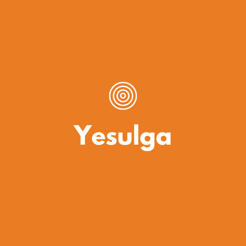

# Yesulga: A multiplayer virtual reality drawing simulation

### Introduction

**When the COVID-19 hit the United States in March. Many school districts weren’t prepared for the unfortunate reality that schools would have to close and students stay home. So many teachers and students are confronted with the reality of virtual learning for the foreseeable future.**

**With a recent introduction of the Oculus Quest 2, which is cheaper, better** than the ****predecessor models. One of the main problem with the original Oculus Quest was front-heavy weight and lack of support and made many hardware upgrades. 

**Notably:**

* Screen resolution is not 1832 x 1920 pixels per eye compared to the original's 1440 x 1600
* Refresh rate of 72Hz to 90 Hz upgrade
* Cheap! \($299 for 64GB and $399 for 256GB\)

## What is Yesulga?

As I previously mentioned Yesulga is a multiplayer virtual reality drawing simulation. I'd like to introduce few core features and possible implementation in the near future.

#### Core features:

* [ ] Each players must have a palette and brush.
* [ ] Right and Left handed option.
* [ ] Multiplayer \(Single player offline for now\).
* [ ] Simple controls.
* [ ] Little or no motion sickness.
* [ ] Voice chat.

#### **Possible Add-Ons**

* [ ] Different drawing tools.
* [ ] Snapshot 
* [ ] Object storage.
* [ ] Unique rooms.
* [ ] Biometric sensors \(exploration phase\).

### Motivations

These VR painting and modelling tools are some of the motivations that inspired me to start this project.

#### Google Tilt Brush

**Tilt Brush** allows professional artists or amateurs to paint in 3D space inside a VR world, using a variety of brushes \(such as ink, smoke, snow and fire\) to create artwork that you can interact with, walk around in, and share as room-scale VR masterpieces or animated GIFs.

I discovered how the Tilt Brush could be used for than just painting - but for [designing sets like the National Theatre’s Immersive Storytelling Studio in London](https://www.digitalartsonline.co.uk/features/creative-software/national-theatre-experiments-with-set-design-in-vr/).

#### The Magic Bottle VR \(Masters thesis\)

It all started with my computer engineering background and numerous projects to formulate the Magic Bottle VR. My ultimate goal goals were to capture real-time biometric values like eye tracking, electrodermal activity \(or galvanic skin response\), and heart rate to observe if there is a significant changes in those biometric activities.

**Unfortunately,** Due to the COVID-19 pandemic, I was unable to significant number of user testing to see the potential of this project. **However**, It also led me to explore possible technology affordances and use cases to impact all aspects of remote learning. Now here I am to introducing my current project: **Yesulga**.

#### Tech Specs \(Links provided\): 

* **​**[**Tobii HTC VR Eye Tracking Headset**](https://imotions.com/hardware/tobii-htc-vive-vr-headset/)**​**
* **​**[**Empatica E4 Wristband**](https://imotions.com/hardware/empatica-e4-eda-gsr-wristband/)





